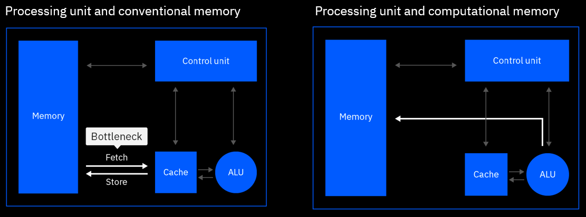
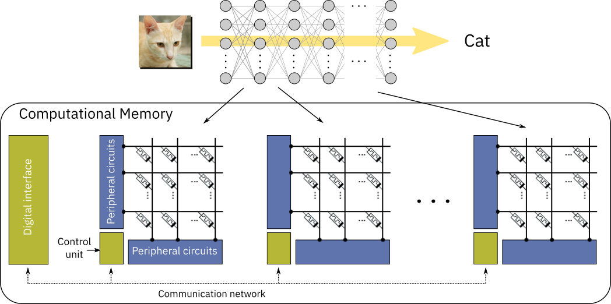

Analog AI
=========

What is analog AI and an analog chip?
-------------------------------------

In a traditional hardware architecture, computation and memory are siloed in
different locations. Information is moved back and forth between computation and
memory units every time an operation is performed, creating a limitation called
the von Neumann bottleneck.

In-memory computing delivers radical performance improvements by combining
compute and memory in a single device, eliminating the von Neumann bottleneck.
By leveraging the physical properties of memory devices, computation happens at
the same place where the data is stored, drastically reducing energy
consumption. Many types of memory devices such as phase-change memory (PCM),
resistive random-access memory (RRAM), and Flash memory can be used for
in-memory computing :ref:`[1] <references>`.
Because there is no movement of data, tasks can be performed in a fraction of
the time and with much less energy. This is different from a conventional
computer, where the data is transferred from the memory to the CPU every time a
computation is done.

In deep learning, data propagation through multiple layers of a neural network
involves a sequence of matrix multiplications, as each layer can be represented
as a matrix of synaptic weights. These weights can be stored in the analog
charge state or conductance state of memory devices. The devices are arranged in
crossbar arrays, creating an artificial neural network where all matrix
multiplications are performed in-place in an analog manner. This structure
allows to run deep learning models at reduced energy consumption
:ref:`[1] <references>`.

An in-memory computing chip typically consists of multiple crossbar arrays of
memory devices that communicate with each other. A neural network layer can be
implemented on (at least) one crossbar, in which the weights of that layer are
stored in the charge or conductance state of the memory devices at the
crosspoints. Usually, at least two devices per weight are used: one encoding the
positive part of the synaptic weight and the other encoding the negative part.
The propagation of data through that layer is performed in a single step by
inputting the data to the crossbar rows and deciphering the results at the
columns. The results are then passed through the neuron nonlinear function and
input to the next layer. The neuron nonlinear function is typically implemented
at the crossbar periphery, using analog or digital circuits. Because every layer
of the network is stored physically on different arrays, each array needs to
communicate at least with the array(s) storing the next layer for feed-forward
networks, such as multi-layer perceptrons (MLPs) or convolutional neural
networks (CNNs). For recurrent neural networks (RNNs), the output of an array
needs to communicate with its input.

The efficient matrix multiplication realized via in-memory computing is very
attractive for inference-only applications, where data is propagated through the
network on offline-trained weights. In this scenario, the weights are typically
trained using a conventional GPU-based hardware, and then are subsequently
programmed into the in-memory-computing chip which performs inference. Because
of device and circuit level non-idealities in the analog in-memory computing
chip, custom techniques must be included into the training algorithm to mitigate
their effect on the network accuracy (so-called hardware-aware training
:ref:`[2] <references>`).

In-memory computing can also be used in the context of supervised training of
neural networks with backpropagation. This training involves three stages:
forward propagation of labelled data through the network, backward propagation
of the error gradients from output to the input of the network, and weight
update based on the computed gradients with respect to the weights of each
layer. This procedure is repeated over a large dataset of labelled examples
for multiple epochs until satisfactory performance is reached by the network.
When performing training of a neural network encoded in crossbar arrays,
forward propagation is performed in the same way as for the inference described
above. The only difference is that all the activations :math:`x_i` of each layer
have to be stored locally in the periphery. Next, backward propagation is
performed by inputting the error gradient :math:`δ_j` from the subsequent layer
onto the columns of the current layer and deciphering the result from the rows.
The resulting sum :math:`\sum_i δ_jW_{ij}` needs to be multiplied by the
derivative of the neuron nonlinear function, which is computed externally, to
obtain the error gradient of the current layer. Finally, the weight update is
implemented based on the outer product of activations and error gradients
:math:`x_iδ_j` of each layer. The weight update is performed in-memory by
applying suitable electrical pulses to the devices which will increase their
conductance in proportion to the desired weight update. See references
:ref:`[1, 3, 4, 5] <references>` for details on different techniques that
have been proposed to perform weight updates with in-memory computing chips.
