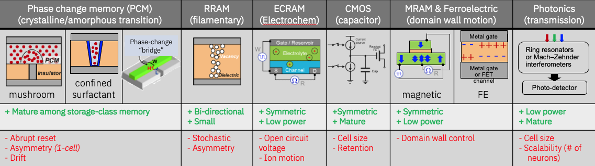

Analog AI Hardware
==================

There are many promising candidates for the resistive element in analog in-memory computing, including Phase Change Memory (PCM), 
Resistive Randam Access memory (RRAM), Electro chemical Random-access memory (ECRAM), Complementary Metal Oxide Semiconductor (CMOS), 
Magnetic RAM (MRAM), Ferroelectric RAM (FERAM or FEFET), and photonics:ref:`[1] <references>`. 

Shown on the figure below is not a complete list of possible resistive elements, but examples of how analog resistance level are achieved 
with various material and circuit implementation. One set of resistive RAM switches based on the formation and dissolution of a filament in a 
non-conductive dielectric material. Intermediate conductance is achieve either by modulating the width of the filament or by modulating the composition 
of the conductive path. Electro-chemical RAM modulates the conductance between source and channel using the gate reservoir voltage that drives ions 
into the channel.CMOS-based capacitive cells can also be used as resistive elements for analog computing, as long as leakage is controlled 
and that the compute and read operations can be completed quickly. Magnetic RAM is a very popular emerging non-volatile memory device with 
usually limited dynamic range that forces its use as binary digital memory. However, using a racetrack memory type implementation, 
precise control of domain wall movement can be used to modulate conductance in an analog fashion. Similar domain wall motion implementation can also be 
applied to ferro-electric devices, though analog in-memory implementation with binary conductance levels but analog accumulation is also actively explored 
using FE-RAM or FE-FETs. Last but not the least, vector-matrix multiplication with photonic devices, where the transmission of light is modulated 
in an analog fashion has also been demonstrated.  

Clearly there is still no ideal Analog AI device as each one of the available options has its strenghts and weaknesses as illustrated in the figure. For instance, 
PCM devices are considered the most mature among storage-class memory types, however they suffer from assymetruc, drift, and abrupt reset. 

This is one of the key motivations behind building a simulator like the aihwkit to allow the exploration of various device and a multitude of charateristics on the 
performance of AI models. 
