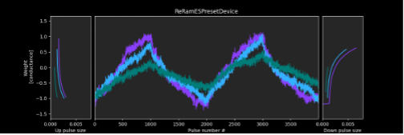
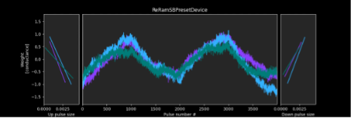
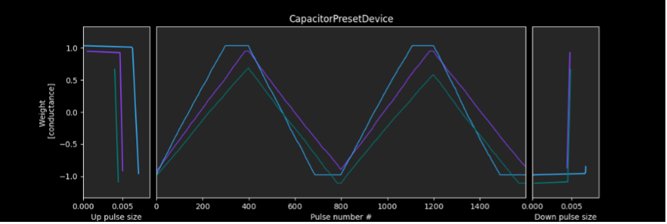
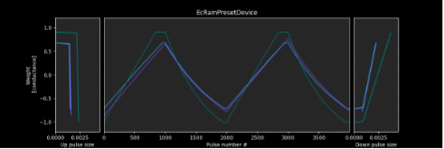

Analog Training Presets
=======================

The toolkit includes built-in analog presets that implement different types of devices that could be used to implement an analog neural network training. 
These presets (except “Idealized analog device”) are calibrated on the measured characteristics of real hardware devices that have 
been fabricated at IBM. Device non-ideal characteristics, noise, and variability are accurately simulated in all presets. 

* a library of device presets that are calibrated to real hardware data and/or
  are based on models in the literature.
* a library of configuration presets that specify a particular device and
  optimizer choice.

The current list of device and configuration presets can be found in the
:py:mod:`aihwkit.simulator.presets` module. These presets can be used directly
instead of manually specifying a ``RPU Configuration``::

    from aihwkit.simulator.tiles import AnalogTile
    from aihwkit.simulator.presets import TikiTakaEcRamPreset

    tile = AnalogTile(10, 20, rpu_config=TikiTakaEcRamPreset())

In what follows we describe in more details the characteristics of some of the Analog training presets. For a comprehensive list
of all available preset configurations, check the :py:mod:`aihwkit.simulator.presets.configs` module.

ReRAM-ES Preset
"""""""""""""""""
**Summary**: Resistive random-access memory (ReRAM) device based on hafnium oxide using exponential step model.

The example below shows how you can use this preset to create a simple Analog Linear layer network. For more details, 
check :py:mod:`aihwkit.simulator.presets.configs.ReRamESPreset` module::

    from aihwkit.simulator.presets import ReRamESPreset

    # Define a single-layer network, using the ReRAM-ES preset.
    rpu_config = SingleRPUConfig(device=ReRamESPreset())
    model = AnalogLinear(4, 2, bias=True, rpu_config=rpu_config)

.. _fig-ReRAM-ES:

Resistive random-access memory (ReRAM) is a non-volatile memory technology with 
tuneable conductance states that can be used for in-memory computing. 
The conductance change of a ReRAM device is bidirectional, that is, it is possible to both 
increase and decrease its conductance incrementally by applying suitable electrical pulses. 
This capability can be exploited to implement the backpropagation algorithm. The change of 
conductance in oxide ReRAM is attributed to change in the configuration of the current conducting 
filament which consists of oxygen vacancies in a metal oxide film. 

This preset is based upon the ReRAM device presented in the work of Gong et al.:ref:`[6] <references>`.
This device was fabricated with hafnium oxide as the metal oxide switching layer. 
The preset captures the experimentally measured response of this device to 1000 positive 
and 1000 negative pulses (shown in the Figure above), including the pulse-to-pulse fluctuations. 
The movement of the oxygen vacancies in response to electrical signals has a probabilistic nature 
and it emerges as inherent randomness in conductance changes. Realistic device-to-device variability 
is also included in the preset to appropriately simulate the behavior of an array of such devices. 

The example below shows how you can create a simple Analog neural network using the ReRAM-RS present::

    from aihwkit.simulator.tiles import FloatingPointTile

    tile = FloatingPointTile(10, 20)

=========================================================== ========
Parameters                                                  Description
=========================================================== ========
Number of steps	                                            1000
Conductance update model	                                  Exponential step
+/- step max. asymmetry 	                                  -670%
Step size variability across devices	                      20%
Step-to-step variability on same device	                    500%
Max/min conductance variability 	                          30%
Instantaneous write noise per step (in % of weight range)	  5%
=========================================================== ========

ReRAM-SB Preset
"""""""""""""""""
**Summary**: Resistive random-access memory (ReRAM) device based on hafnium oxide using soft bounds model.

The example below shows how you can use this preset to create a simple Analog Linear layer network. For more details, 
check :py:mod:`aihwkit.simulator.presets.configs.ReRamSBPreset`::

      from aihwkit.simulator.presets import ReRamSBPreset

      rpu_config=ReRamSBPreset()
      model = AnalogLinear(4, 2, bias=True, rpu_config=rpu_config)

.. _fig-ReRAM-SB:

This preset is similar **ReRAM-SB** preset except that it uses a soft bounds model instead 
of an exponential model. The parameters of this preset as shown in the table below:

 =========================================================== ========
 Parameters                                                  Description
 =========================================================== ========
 Number of steps	                                         1000
 Conductance update model	                                 Soft Bounds
 +/- step asymmetry  (at w=0.75)	                         -400% 
 Step size variability across devices	                     30%
 Step-to-step variability on same device	                 375%
 Max/min conductance variability 	                         30%
 Instantaneous write noise per step (in % of weight range)	 5%
 =========================================================== ========

Capacitor-cell Preset
""""""""""""""""""""""
**Summary**: Capacitor-based unit cell device using trench capacitor in 14nm CMOS technology. 
For more details, check :py:mod:`aihwkit.simulator.presets.configs.CapacitorPreset` module.

.. _fig-CapacitorCell:

A capacitor-based cross-point array can be used to train analog neural networks. A capacitor can serve as an analog memory, 
connected to the gate of a “readout” pFET. During readout, the synaptic weight can be accessed by measuring the conductance 
of the readout FET. During weight update, the capacitor is charged/discharged by two “current source” FETs, as controlled by 
two analog inverters and one digital inverter. Charge can be added or subtracted continuously if the number of electrons is high, 
so analog and symmetric weight update can be achieved. Capacitor-cells have demonstrated some of the best linearity and symmetry 
characteristics among analog devices, making them a promising candidate for neural network training. 

This preset is based upon the capacitor-based cross-point array presented in the work of Li et al.::ref:`[7] <references>`.
The array was fabricated with trench capacitors in 14nm CMOS technology. The preset captures the experimentally measured response 
of this device to 400 positive update and 400 negative update pulses (shown in Figure 6), including the pulse-to-pulse fluctuations. 
The reported asymmetry between positive and negative updates of 10% is included as well as the cell-to-cell asymmetry variations. 
Capacitor leakage is also simulated by exponentially decreasing the weight values over training mini-batches, and cell-to-cell variations 
in leakage are included. Realistic pulse-to-pulse and device-to-device variability is also included in the preset to appropriately simulate 
the effect of non-ideal characteristics such as readout variation and variation of current sources. 

=========================================================== ========
Parameters                                                  Description
=========================================================== ========
Number of steps	                                             400
Conductance update model	                                   Linear step
+/- step max. asymmetry 	                                   -10%
Step size variability across devices	                       10%
Step-to-step variability on same device	                     30%
Max/min conductance variability 	                           7%
Leakage (in mini-batches)	                                   106
=========================================================== ========

ECRAM Preset
""""""""""""""""""""""
**Summary**: Electro-Chemical Random-Access Memory (ECRAM) device based on lithium (Li) ion intercalation in tungsten oxide (WO3). 
For more details, check :py:mod:`aihwkit.simulator.presets.configs.EcRamPreset` module.

.. _fig-EcRam:

Electro-Chemical Random-Access Memory (ECRAM) is a three terminal non-volatile electrochemical switch that has been proposed as an artificial synapse 
for Analog AI. The electrochemically driven intercalation or redox reaction can be precisely and reversibly controlled by the amount of charge through 
the gate, so it can provide near-symmetric switching with plentiful discrete states and reduced stochasticity. As a trade-off for cell complexity using 
three-terminal device, the read and write operations are decoupled, allowing for better endurance and low-energy switching while maintaining non-volatility. 
These attributes make ECRAM a promising device candidate for neural network training applications. 

This preset is based upon the ECRAM device presented in the work of Tang et al.::ref:`[7] <references>`. Lithium phosphorous 
oxynitride (LiPON) was used as a solid-state electrolyte. The amount of Li ions intercalated in WO3 is precisely controlled by the gate current and 
this process is reversible, enabling near-symmetric update. In operation, series of positive (negative) current pulses are fed into the gate for 
potentiation (depression).The preset captures the experimentally measured response of this device to 1000 positive and 1000 negative pulses 
(shown in Figure 13 in the paper), including the pulse-to-pulse fluctuations. Realistic device-to-device variability is also included in the preset 
to appropriately simulate the behavior of an array of such devices. 

=========================================================== ===========
Parameters                                                  Description
=========================================================== ===========
Conductance update model	                                 Linear step
+/- step max. asymmetry 	                                 -75%
Step size variability across devices	                     10%
Step-to-step variability on same device                     30%
Max/min conductance variability 	                           5%
=========================================================== ===========

