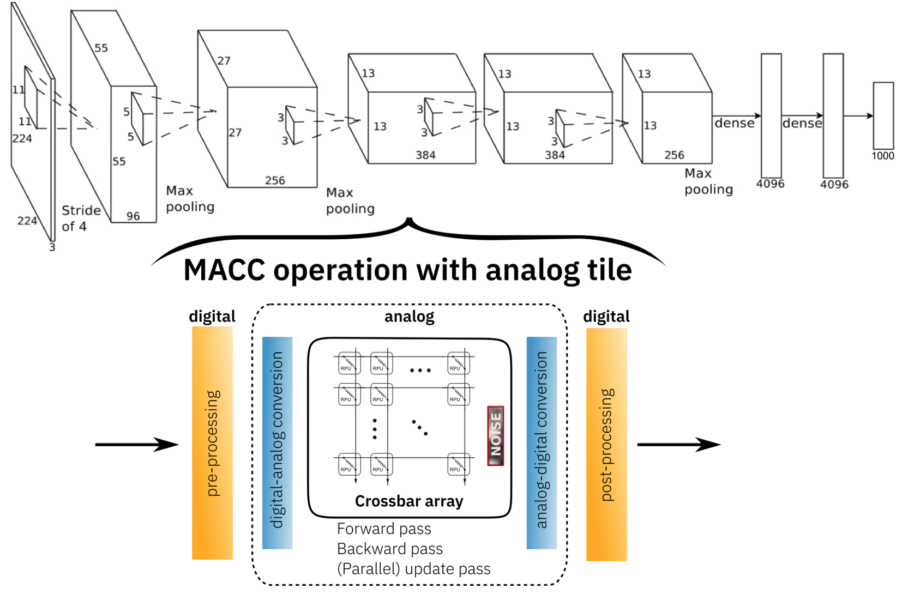
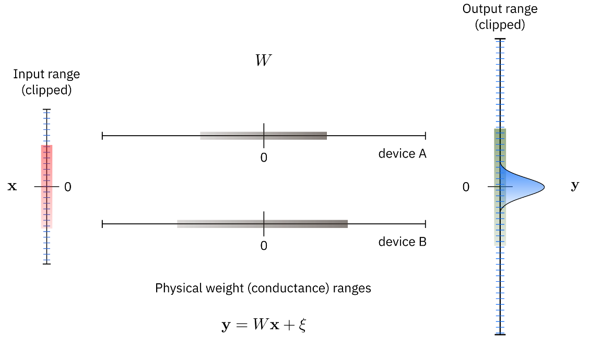
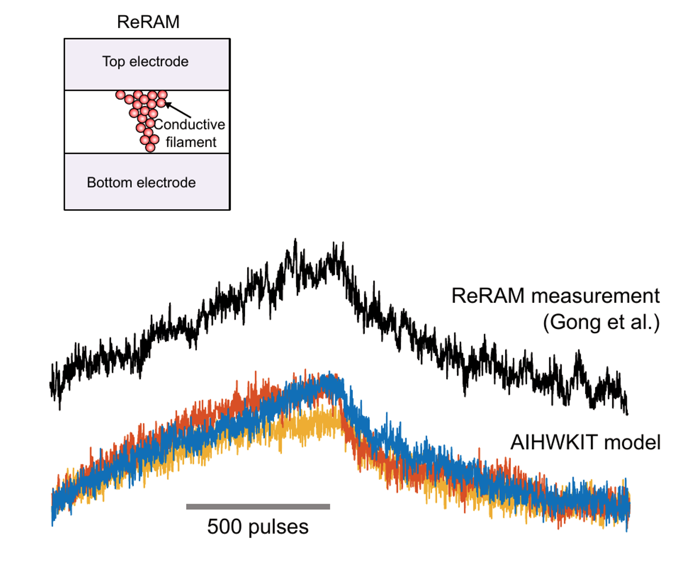
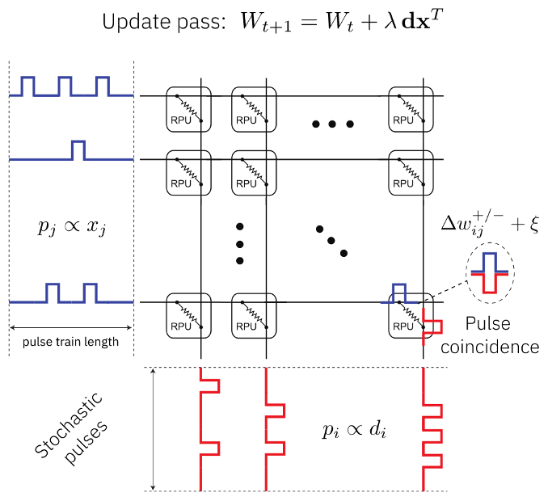
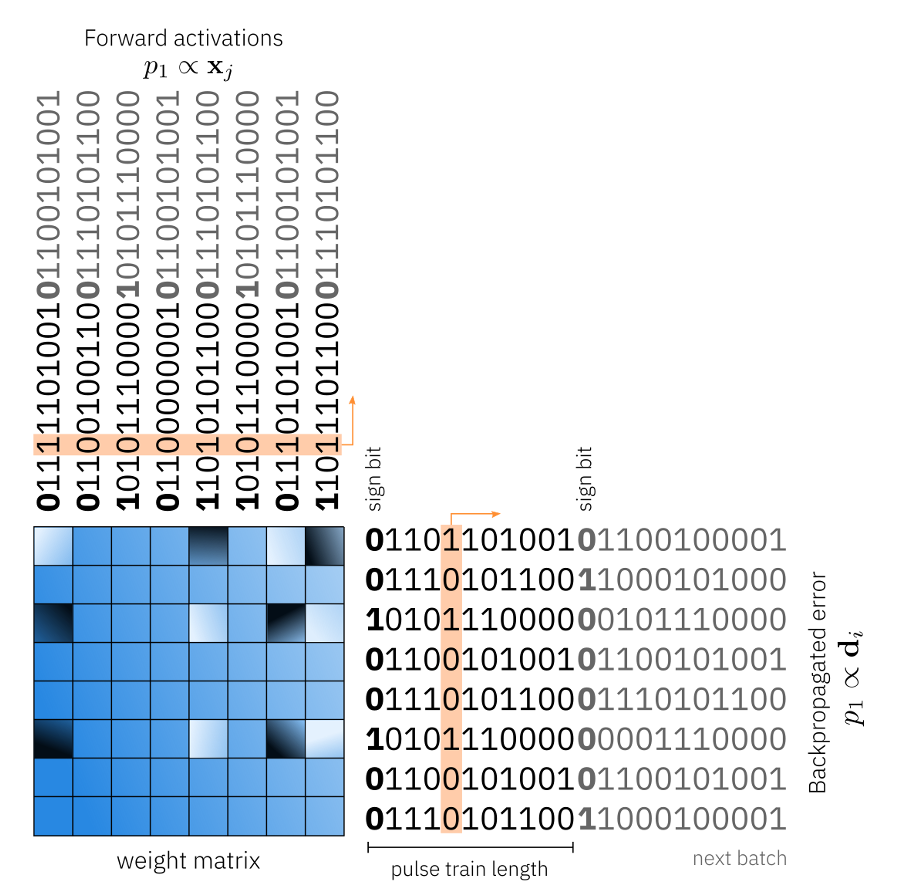
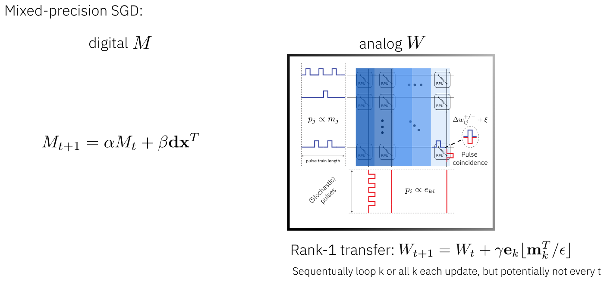
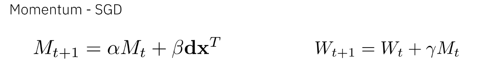
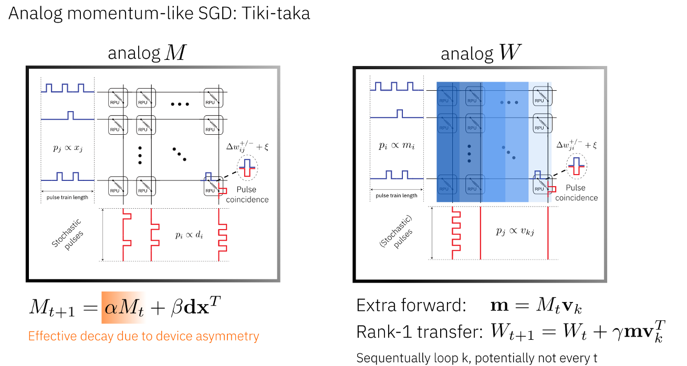

Specialized Update Algorithms
=============================

To accelerate the training of a DNN, the analog accelerator needs to implement the forward, backward, and updates passes 
necessary for computing stochastic gradient descent. We further assume that only the matrix vector operations are accelerated in Analog, \
not the non-linear activation functions or the pooling functions. These latter are done in the digital domain. We assume that there will be separate 
digital compute units available on the same chip. 

To be able to use digital co-processors along with the Analog in-memory computer processors, the activations need to be converted to 
analog for each crossbar array using digital-to-analog convertors (DAC) or analog-t—digital conversions (ADC). Additionally, there might be additional 
digital pre- and post-processing such as activation scaling or bias correction shifting which will be done in floating point or digital as well.

The toolkit provides a functional simulation for forward, backward and update passes. Since we want to be able to scale up the simulation to relevant 
neural network sizes, it is not feasible to simulate the physical system in great details. For simulating non-idealities of the analog forward, 
backward passes, we use an abstract way to represent only the effective noise sources and non idealities that might have various origins in the physical system. 
We do not simulate them explicitly. However, we can define different noises and noise strengths for input, output, and weights.  
Additionally, the value range of the input, output, and the weights are limited because of the physical implementation details and hardware limitations. 
We also provide a simple way to quantize the input and output to simulate digital to analog and analog to digital conversion as well as various pre- and 
post-processing schemes that can be selected such as dynamic input range normalization. 

For the update pass, we have put a lot of effort into the simulator to be able to estimate the impact of the noise characteristics of different material choices 
such as asymmetric resistive device update behavior or device to device variability. During the update path, to apply the gradient, the device conductance that 
caused the break value needs to be incrementally changed by a certain amount. To achieve this behavior, several finite-sized pulses are sent to the device 
causing change in the conductance values. This induced conductance change, however, is very noisy for many device materials as shown in the plot below. 

The upper line shows the conductance change of a given measured ReRAM device in response to 500 pulses in the up direction followed by 500 pulses in the down 
direction. Each of applied voltage pulses has the same strength in theory but the response is extremely noisy as illustrated in the figure. 
These three example traces show the implemented ReRAM model in the simulator, and it shows that it captures the measured conductance response curve quite well. 
One can also see the device-to-device variability in this case as illustrated by the three different colored plots. Here we show 3 different device updates. 

We have implemented several different ways to perform the update in Analog and hope to extend the number of available optimizers in the future:

* Plain SGD: Fully parallel update using stochastic pulse trains by Gokmen & Vlasov::ref:`[9] <references>`.
* Mixed precision: Digital rank update and transfer by Nandakumar et al.::ref:`[4] <references>`.
* Tiki-taka (TTv1): Momentum-like SGD update by Gokmen & Haensch::ref:`[10] <references>`.
* TTv2: Buffered transfer with a floating-point H buffer by Gokmen::ref:`[16] <references>`.
* TTv3 (c-TTv2): Chopped-TTv2, buffered transfer with input/output choppers by Rasch et al.::ref:`[17] <references>`.
* TTv4 (AGAD): Analog Gradient Accumulation with Dynamic reference by Rasch et al.::ref:`[17] <references>`.

These algorithmic improvements and the adaptation of existing algorithms to the characteristics of Analog hardware is one of the key focus areas of this toolkit. 

Plain SGD optimizer implements a fast way to do the gradient update fully in Analog using coincidences of stochastic pulse trains to compute
the outer product as was suggested by the paper of Gokmen & Vlasov::ref:`[9] <references>`. The Mixed precision optimizer was proposed by Nandakumar
et al in 2020::ref:`[4] <references>`. In this optimizer, the outer product to form the weight gradients is computed in digital. Compared to the first optimizer, we have more digital
compute units on this chip than the first one which has the update fully in parallel. This would be a good choice for much more non-ideal devices. The Tiki-taka
optimizer (TTv1) implements an algorithm that is similar to momentum SGD and assumes that both the momentum term and
the weight matrix are on analog crossbar arrays as discussed in :ref:`[10] <references>`. TTv2 adds a floating-point H buffer between the fast and slow
arrays :ref:`[16] <references>`, enabling lossless accumulation of fractional gradient steps. TTv3 (c-TTv2) further introduces input/output choppers that suppress
systematic bias :ref:`[17] <references>`, and TTv4 (AGAD) extends TTv3 with a statistical approach for computing the gradient update :ref:`[17] <references>`.

Plain SGD: Fully Parallel Update 
---------------------------------

We discuss in this section how the parallel update process was implemented based on the work Gokmen & Vlasov::ref:`[9] <references>`. During the update pass, we need to compute the weight gradients is the outer product 
between the backpropagated error vector d and the activation vector x,  which then needs to be added to the weight matrix. This can be done in Analog as follows. 
To compute the outer product between the backpropagated error vector and the activation vector, each side of the crossbar array receives stochastic pulse trains 
where the probability of having a pulse is proportional to the activation vector x or the error vector d. Since the pulses are drawn stochastically independent, 
the probability of having a coincidence is given by the product of both probabilities. So, when the coincidences are causing the incremental conductance change, 
the weight gradient updated is in this manner is performed in constant time for the full analog array in parallel. This is exactly what one needs to compute the 
product of the d and x and the update. 
In our implementation, we simulate this parallel update in great detail. In particular, we draw the random trains explicitly and apply up or down conductance 
changes only in case of a coincidence. Each coincidence of the conductance change of the configured device model will be applied which includes full cycle to cycle variations, 
device to device variabilities, and IR drop (the voltage drop due to energy losses in a resistor). 

Mixed Precision
---------------
The mixed precision optimizer is similar algorithmically to momentum SGD. In momentum SGD, the weight gradients are not directly applied to the weight 
matrix but first added in a leaky fashion to the momentum matrix M and then the momentum matrix is applied to the weight matrix. 
In this mixed precision optimizer the matrix M is computed in digital floating-point precision. This matrix is then used to update the weight matrix which is 
computed in analog. This way, the analog update will happen less often in each mini batch. 
The mixed precision optimizer will need a large amount of digital compute as the outer product is not calculated in Analog. 

A list of mixed precisin presets to implement mixed precision optimizer on different Analog devices. The list is below:
  
* :class:`~aihwkit.simulator.configs.presets.MixedPrecisionReRamESPreset`          
* :class:`~aihwkit.simulator.configs.presets.MixedPrecisionReRamSBPreset`          
* :class:`~aihwkit.simulator.configs.presets.MixedPrecisionCapacitorPreset`       
* :class:`~aihwkit.simulator.configs.presets.MixedPrecisionEcRamMOPreset`          
* :class:`~aihwkit.simulator.configs.presets.MixedPrecisionGokmenVlasovPreset`     
     
See `example 12 <https://github.com/IBM/aihwkit/blob/master/examples/12_simple_layer_with_mixed_precision.py>`_ 
for an illustration of how to use the mixed precision update in the aihwkit::ref:`[4] <references>`.

Tiki-taka (TTv1): Momentum-like SGD Update
------------------------------------------
Tiki-Taka optimizer is also algorithmically similar to momentum SGD. The difference here is that the momentum matrix is also in Analog. 
This implied that the outer product update onto the momentum matrix is done on analog in fully parallel mode using stochastic pulse trains 
we described earlier. Therefore, this optimizer does not have the potential bottleneck to compute the outer product in digital as done in the 
mixed precision optimizer. A nice feature of this algorithm is how the decay of the momentum term is achieved. Because the multiplicative 
decay of conductance values of an analog crossbar array is not easily achievable in hardware. 
Instead, the device update asymmetry is used to implicitly decay the conductance values caused by random up and down pulses. 
This is explained in more details in this paper. 

**TTv1 Formulation**

The core update equations for Tiki-taka (TTv1) are:

.. math::

   A = A \mathrel{-} \beta \cdot \text{Gradient}

.. math::

   C = C \mathrel{+} \alpha \cdot A

Where:

* :math:`A` is the fast (momentum) array, updated at every gradient step with learning rate :math:`\beta` 
* :math:`C` is the slow (weight) array, updated periodically via transfer events with coefficient :math:`\alpha`
* The gradient is computed on :math:`\gamma \cdot A + C`, where :math:`\gamma` controls the contribution of A to the effective weight. 

The key distinguishing feature is that momentum decay is achieved implicitly through device asymmetry (random up/down pulses on :math:`A`) rather than explicit multiplicative decay, which is difficult to implement in analog hardware.

**Residual Learning and Bit-Slicing with Non-Zero** :math:`\gamma`

The ``gamma`` parameter enables two complementary mechanisms in TTv1-TTv3:

.. math::

   W_{\text{eff}} = \gamma \cdot A + C

The gradient is evaluated at the effective weight :math:`\gamma A + C` rather than at C alone, 
so A can directly influence the gradient direction and magnitude.  
The relative contribution of A is controlled by ``gamma``:

**When** ``gamma = 0`` **(default):** A is fully hidden — gradients are
evaluated only at C.  A acts as a hidden momentum buffer whose content is
periodically transferred to C.  Because transfers are discrete and
infrequent, C may lag the true gradient direction, introducing gradient
staleness.

**When** ``gamma > 0`` **:** A becomes an active *residual branch* on top of C,
enabling two complementary mechanisms:

1. **Residual learning:** A can now track the residual of C: after each
   transfer, any remaining deviation of C from the ideal weight (due to
   device non-linearity, write noise, saturation, or drift) is visible in the
   gradient evaluated at :math:`\gamma A + C`.  This gradient drives A in the
   direction that corrects C's error, so A continuously compensates for
   whatever C fails to represent.  When the next transfer event fires, the
   correction accumulated in A is pushed into C, pulling it closer to the
   ideal weight.  The mechanism is analyzed in detail by Wu et al.::ref:`[18] <references>`.

2. **Bit-slicing (precision enhancement):** The two-layer decomposition
   :math:`W = \gamma A + C` acts as a *bit-slicing* mechanism: the fast array A
   can represent finer-grained weight updates (higher effective precision) while
   the slow array C provides stable storage of the coarse weight values.  By
   tuning ``gamma`` and the transfer frequency, the effective weight granularity
   can be reduced below the device's native conductance step, enabling higher
   training accuracy without modifying the underlying analog device.  This
   approach is particularly valuable when C's device granularity is coarse or
   non-uniform.  See Li et al.::ref:`[19] <references>` for its extention to multi-array
   setting as well as the detailed analysis.

TTv2: Buffered Transfer
-----------------------
The buffered transfer algorithm (TTv2), proposed by Gokmen::ref:`[16] <references>`, extends
Tiki-taka by introducing a floating-point H buffer between the fast analog array A and the
slow weight array C.  Instead of sending stochastic update pulses to C at every gradient step,
each transfer event first reads a column of A and accumulates the result in the digital buffer H:

.. math::

   H \mathrel{+}= \alpha \cdot A

where :math:`\alpha` is a learning-rate scale factor.  An integer number of pulses is sent to C
only when the accumulated value exceeds the threshold :math:`|H| \geq 1`, after which H is
reduced by the number of steps taken (or decayed by a momentum factor when ``forget_buffer=True``).

This buffered scheme provides two key advantages over plain Tiki-taka (TTv1):

* **Reduced write noise on C** — pulses are sent to the slow device only when the buffer
  is large enough to justify a full integer step, so C is updated less frequently and with
  steps that match its conductance granularity.
* **Lossless accumulation** — fractional gradient contributions that would otherwise be
  rounded away by the finite granularity of C are preserved in the floating-point buffer
  until they can be committed.

The algorithm is configured via
:class:`~aihwkit.simulator.configs.compounds.BufferedTransferCompound`.

TTv3 (c-TTv2): Chopped Buffered Transfer
-----------------------------------------
TTv3, originally named **Chopped-TTv2 (c-TTv2)** by Rasch et al.::ref:`[17] <references>`, extends TTv2 by adding *choppers* —
random binary sign-flip patterns applied to the input (and optionally output) of each transfer
read.  After each column read of A, the row chopper sign is randomly toggled with probability
``in_chop_prob``; the current chopper state multiplies both the update written to A and the
value accumulated in H:

.. math::

   H \mathrel{+}= \text{chopper} \cdot \alpha \cdot A

Because the chopper sign is applied consistently to both the write and the read, the effective
gradient in H is unbiased.  Systematic device offsets and long-range correlations on the fast
array A average out over successive chopper flips, enabling more aggressive transfer rates
without accumulating systematic errors on C.

The standard TTv3 transfer logic — accumulation, threshold crossing, and pulse dispatch to C —
is identical to TTv2.  The sole difference is that all reads of A are chopper-modulated.  Both
input choppers (``in_chop_prob``) and output choppers (``out_chop_prob``) can be configured
independently.

The algorithm is configured via
:class:`~aihwkit.simulator.configs.compounds.ChoppedTransferCompound`.

.. _using_simulator: using_simulator.html

TTv4 (AGAD): Dynamic Chopped Transfer
---------------------------------------
TTv4, originally named **Analog Gradient Accumulation with Dynamic reference (AGAD)** by
Rasch et al.::ref:`[17] <references>`, extends TTv3 by introducing a dynamic *symmetric point
tracking* mechanism for establishing reference values on-the-fly, using a modest amount of
additional digital compute, rather than relying on a separate reference conductance array or
differential read circuitry.

Concretely, TTv4 establishes dynamic symmetric points by comparing the running mean of reads
taken during the two most recent chopper half-periods.  The transfer onto C is proportional to
the *difference* between these two half-period means:

.. math::

   \Delta C \propto \bar{A}_{\text{new}} - \bar{A}_{\text{old}}

No update is dispatched to C when this difference is not statistically distinguishable from
noise, as judged by the running standard-deviation estimate (i.e., a standard-error of the
mean noise gate is applied).  Because the reference values are derived from the device reads
themselves rather than from a separately measured baseline, AGAD greatly simplifies hardware
design — it does not need a separate conductance array for reference values or differential
read circuitry.

The algorithm is configured via
:class:`~aihwkit.simulator.configs.compounds.DynamicTransferCompound`.

