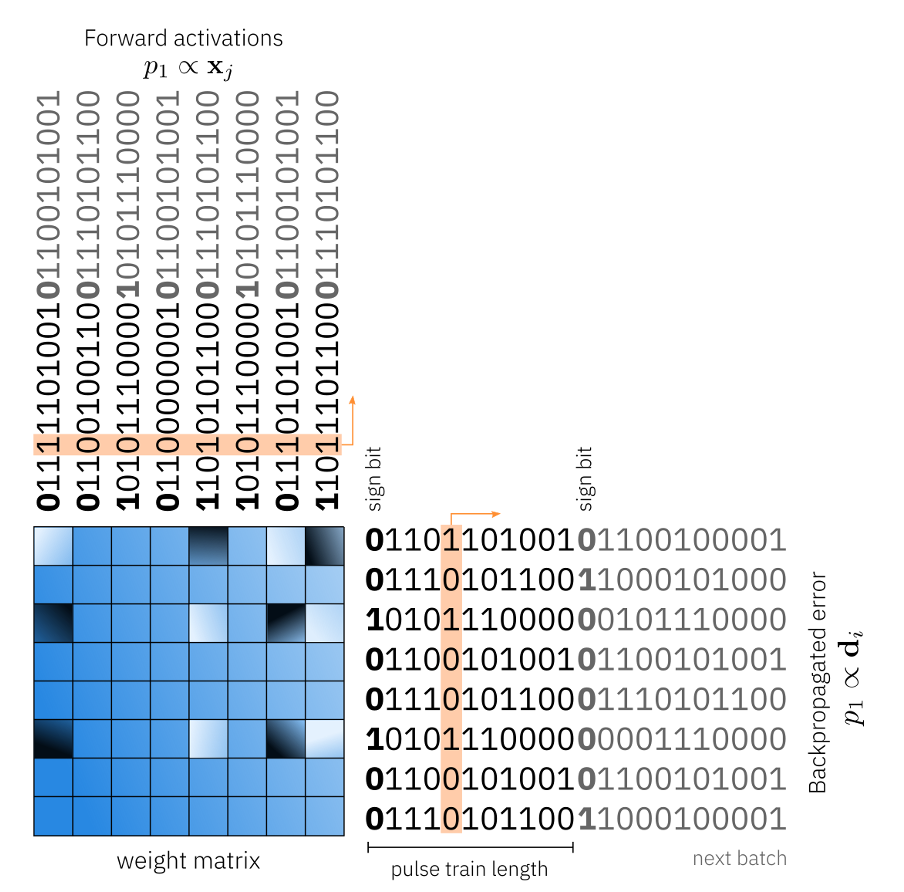

Specialized Update Algorithms
=============================

To accelerate the training of a DNN, the analog accelerator needs to implement the forward, backward, and updates passes 
necessary for computing stochastic gradient descent. We further assume that only the matrix vector operations are accelerated in Analog, \
not the non-linear activation functions or the pooling functions. These latter are done in the digital domain. We assume that there will be separate 
digital compute units available on the same chip. 

To be able to use digital co-processors along with the Analog in-memory computer processors, the activations need to be converted to 
analog for each crossbar array using digital-to-analog convertors (DAC) or analog-t—digital conversions (ADC). Additionally, there might be additional 
digital pre- and post-processing such as activation scaling or bias correction shifting which will be done in floating point or digital as well.

.. image:: ../img/analog_dnn_training.png
   :alt: Accelerating DNN Training with Analog

The toolkit provides a functional simulation for forward, backward and update passes. Since we want to be able to scale up the simulation to relevant 
neural network sizes, it is not feasible to simulate the physical system in great details. For simulating non-idealities of the analog forward, 
backward passes, we use an abstract way to represent only the effective noise sources and non idealities that might have various origins in the physical system. 
We do not simulate them explicitly. However, we can define different noises and noise strengths for input, output, and weights.  
Additionally, the value range of the input, output, and the weights are limited because of the physical implementation details and hardware limitations. 
We also provide a simple way to quantize the input and output to simulate digital to analog and analog to digital conversion as well as various pre- and 
post-processing schemes that can be selected such as dynamic input range normalization. 

.. image:: ../img/toolkit_quantization.png
   :alt: Input and Output Quantization

For the update pass, we have put a lot of effort into the simulator to be able to estimate the impact of the noise characteristics of different material choices 
such as asymmetric resistive device update behavior or device to device variability. During the update path, to apply the gradient, the device conductance that 
caused the break value needs to be incrementally changed by a certain amount. To achieve this behavior, several finite-sized pulses are sent to the device 
causing change in the conductance values. This induced conductance change, however, is very noisy for many device materials as shown in the plot below. 

.. image:: ../img/reram_measurements.png
   :alt: AIHWKIT Model fit to Real Data Measurements

The upper line shows the conductance change of a given measured ReRAM device in response to 500 pulses in the up direction followed by 500 pulses in the down 
direction. Each of applied voltage pulses has the same strength in theory but the response is extremely noisy as illustrated in the figure. 
These three example traces show the implemented ReRAM model in the simulator, and it shows that it captures the measured conductance response curve quite well. 
One can also see the device-to-device variability in this case as illustrated by the three different colored plots. Here we show 3 different device updates. 

We have implemented 3 different ways to perform the update in Analog and hope to extend the number of available optimizers in the future:

* Plain SGD: Fully parallel update using stochastic pulse trains by Gokmen & Vlasov::ref:`[9] <references>`.
* Mixed precision: Digital rank update and transfer by Nandakumar et al.::ref:`[4] <references>`.
* Tiki-taka: Momentum-like SGD update by Gokmen & Haensch::ref:`[10] <references>`.

These algorithmic improvements and the adaptation of existing algorithms to the characteristics of Analog hardware is one of the key focus areas of this toolkit. 

Plain SGD optimizer implements a fast way to do the gradient update fully in Analog using coincidences of stochastic pulse trains to compute 
the outer product as was suggested by the paper of Gokmen & Valsov::ref:`[9] <references>`. The Mixed precision optimizer was proposed by Nandakumar
et al in 2020::ref:`[4] <references>`. In this optimzer, the outer product to form the weight gradients is computed in digital. Compared to the first optimizer, we have more digital 
compute units on this chip than the first one which has the update fully in parallel. This would be a good choice for much more non-ideal devices. The third 
optimizer called Tiki Taka implements an algorithm that is similar to momentum stochastics gradient decent and assumes that both the momentum term and 
the weight matrix are on analog cross bar arrays as discussed in:ref:`[10] <references>`. The gradient update computation onto the momentum matrix uses the same fast update it it was 
explained in the plain SGD case. 

Plain SGD: Fully Parallel Update 
---------------------------------

We discuss in this section how the parallel update process was implemented based on the work Gokmen & Vlasov::ref:`[9] <references>`. During the update pass, we need to compute the weight gradients is the outer product 
between the backpropagated error vector d and the activation vector x,  which then needs to be added to the weight matrix. This can be done in Analog as follows. 
To compute the outer product between the backpropagated error vector and the activation vector, each side of the crossbar array receives stochastic pulse trains 
where the probability of having a pulse is proportional to the activation vector x or the error vector d. Since the pulses are drawn stochastically independent, 
the probability of having a coincidence is given by the product of both probabilities. So, when the coincidences are causing the incremental conductance change, 
the weight gradient updated is in this manner is performed in constant time for the full analog array in parallel. This is exactly what one needs to compute the 
product of the d and x and the update. 
In our implementation, we simulate this parallel update in great detail. In particular, we draw the random trains explicitly and apply up or down conductance 
changes only in case of a coincidence. Each coincidence of the conductance change of the configured device model will be applied which includes full cycle to cycle variations, 
device to device variabilities, and IR drop (the voltage drop due to energy losses in a resistor). 

Mixed Precision
---------------
The mixed precision optimizer is similar algorithmically to momentum SGD. In momentum SGD, the weight gradients are not directly applied to the weight 
matrix but first added in a leaky fashion to the momentum matrix M and then the momentum matrix is applied to the weight matrix. 
In this mixed precision optimizer the matrix M is computed in digital floating-point precision. This matrix is then used to update the weight matrix which is 
computed in analog. This way, the analog update will happen less often in each mini batch. 
The mixed precision optimizer will need a large amount of digital compute as the outer product is not calculated in Analog. 

A list of mixed precisin presets to implement mixed precision optimizer on different Analog devices. The list is below:
  
* :class:`~aihwkit.simulator.configs.presets.MixedPrecisionReRamESPreset`          
* :class:`~aihwkit.simulator.configs.presets.MixedPrecisionReRamSBPreset`          
* :class:`~aihwkit.simulator.configs.presets.MixedPrecisionCapacitorPreset`       
* :class:`~aihwkit.simulator.configs.presets.MixedPrecisionEcRamMOPreset`          
* :class:`~aihwkit.simulator.configs.presets.MixedPrecisionGokmenVlasovPreset`     
     
See `example 12 <https://github.com/IBM/aihwkit/blob/master/examples/12_simple_layer_with_mixed_precision.py>`_ 
for an illustration of how to use the mixed precision update in the aihwkit::ref:`[4] <references>`.

Tiki-taka: Momentum-like SGD Update
-----------------------------------
Tiki-Taka optimizer is also algorithmically similar to momentum SGD. The difference here is that the momentum matrix is also in Analog. 
This implied that the outer product update onto the momentum matrix is done on analog in fully parallel mode using stochastic pulse trains 
we described earlier. Therefore, this optimizer does not have the potential bottleneck to compute the outer product in digital as done in the 
mixed precision optimizer. A nice feature of this algorithm is how the decay of the momentum term is achieved. Because the multiplicative 
decay of conductance values of an analog crossbar array is not easily achievable in hardware. 
Instead, the device update asymmetry is used to implicitly decay the conductance values caused by random up and down pulses. 
This is explained in more details in this paper. 

