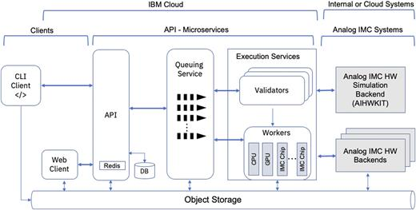

Analog AI Cloud Composer Overview
===================================

In the following, we describe the Analog AI Cloud Composer (AAICC) platform, a cloud offering that provides the benefits of using the AIHWKit simulation platform in a fully managed cloud setting.
The Analog Composer is introducing for the first time Analog AI as a service or, in short, AAaaS.
The cloud composer can be freely accessed at `Analog AI Cloud Composer`

Composer Design and Architecture.
---------------------------------

The AAICC is a novel approach to AIMC that leverages the AIHWKit simulation platform to allow a seamless,
no-code interactive cloud experience. With access to the open-source AIHWKit libraries and an easy-to-use
interface, it provides a platform for researchers, hardware-engineers, developers, and enthusiasts to explore,
experiment, simulate, and create Analog AI neural networks and tune various analog devices to create
accurate and sustainable AI models. This platform also serves as an educational tool to democratize IMC and introduce
its key concepts.

The AAICC adopts a modern distributed architecture based on IBM Cloud services and guidelines.
The user input is limited to data (not code) with strong control and validations during the lifecycle of
the application and the input data. The design maintains a separation of concerns and responsibilities between
the various components. Tracking, monitoring, and auditing services are enforced to ensure security and
compliance according to IBM Cloud security standards.

The architecture of the AAICC can be divided into five main components, as illustrated in  below figure

* a. *The Front-end Client Component:* This component provides an entry point for clients to interact with the composer application. Two scenarios are supported. The user can interact with the composer through a web application or through the command-line interface. Through this component, the user defines a training or inference experiment that can run on the AIHWKit simulator.

* b. *The API:* The API component is an HTTP microservice that provides the endpoints that are used by the web application and the backend Python libraries. The API provides user authentication, database access, setup of the queuing system, job process flow setup, and collection of various statistics.

* c. *The Backend Execution Services:* These services are responsible for executing all the training and inference jobs that are submitted by end users. There are two sub-components in the execution services: the validator and the workers. The validator service ensures that all training and inference jobs that are submitted are composed correctly and adhere to the specifications of the AIHWKit for defining the neural network, the various training or inference parameters, and the supported hardware configurations. For example, it validates that the analog layers and the RPUConfig are correctly defined. The workers are responsible for executing the submitted experiments and sending the results to the front end component for web rendering. Various worker instances are implemented, depending on the backend infrastructure that will be used to execute the experiment. We have implemented three workers. The GPU worker provides GPU acceleration for running the AIHWKit training or inference experiments. The central processing unit (CPU) worker will run the submitted experiments on a CPU backend server. The IMC hardware worker will run the experiments on supported IMC chips. The design is flexible as it allows us to plugin more workers as more IMC chips are implemented or different backend implementations are added. The infrastructure is also based on Kubernetes, which allows automatic scaling of the resources depending on the load the application receives from end-users.

* d. *The Queuing Services:* This component provides the asynchronous-based communication backbone between the various components of the composer application. It implements various message queues for the CPU, GPU, and any future IMC hardware backends. The CPU and GPU queues are used to route jobs to the AIHWKit backend simulation library and receive notifications of the results when the jobs are done. The IMC hardware queue(s) are used to route the jobs to analog IMC chips that will be supported on the platform. In addition, we have a validator queue that serves the communication between the validator and the execution workers.

* e. *The Backend Analog IMC Systems:* This component provides access to the AIHWKit for simulating training or inference on a variety of AIMC hardware options. Real AIMC chips will also be used to run inference or training on actual hardware.

.. _`Analog AI Cloud Composer`_: https://aihw-composer.draco.res.ibm.com
