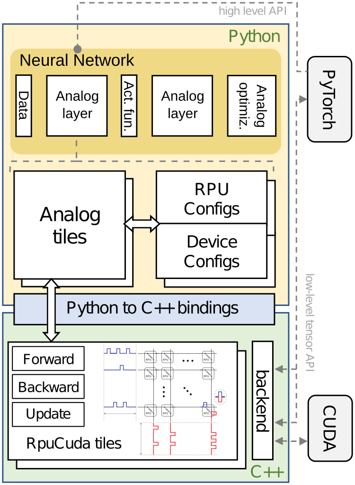

``aihwkit`` design
==================

``aihwkit`` layers
------------------

The architecture of the library is comprised by several layers:

Pytorch layer
~~~~~~~~~~~~~

The Pytorch layer is the high-level layer that provides primitives to users for
using the features on the library from Pytorch, in particular layers and
optimizers.

Overall, the elements on this layer take advantage of Pytorch facilities
(inheriting from existing Pytorch classes and integrating with the rest of
Pytorch features), replacing the default functionality with calls to a ``Tiles``
object from the simulator abstraction layer.

Relevant modules:

* :py:mod:`aihwkit.nn`
* :py:mod:`aihwkit.optim`

Python simulator abstraction layer
~~~~~~~~~~~~~~~~~~~~~~~~~~~~~~~~~~

This layer provides a series of Python objects that can be transparently
manipulated and used as any other existing Python functionality, without
requiring explicit references to the lower level constructs. By providing this
separate Python interface, this allows us for greater flexibility when defining
it, keeping all the extra operations and calls to the real bindings internal
and performing any translations on behalf of the user.

The main purpose of this layer is to abstract away the implementation-specific
complexities of the simulator layers, and map the structures and classes into
an interface that caters to the needs of the Pytorch layer. This also provides
benefits in regards to serialization and separating concerns overall.

Relevant modules:

* :py:mod:`aihwkit.simulator.tiles`
* :py:mod:`aihwkit.simulator.devices`
* :py:mod:`aihwkit.simulator.parameters`

Pybind Python layer
~~~~~~~~~~~~~~~~~~~

This layer is the bridge between C++ and Python. The Python classes and
functions in this layer are built using Pybind, and in general consist of
exposing selected classes and methods from the C++ simulator, handling the
conversion between specific types.

As a results, using the classes from this layer is very similar to how using
the C++ classes would be. This is purposeful: by keeping the mapping close to
1:1 on this layer, we (and users that are experimenting directly with the
simulator) benefit from being able to translate code almost directly. However,
in general users are encouraged to not use the objects from this layer direcly,
as it involves an extra overhead and precautions when using them that is
managed by the upper classes.

* :py:mod:`aihwkit.simulator.rpu_base.tiles`
* :py:mod:`aihwkit.simulator.rpu_base.devices`
* :py:mod:`aihwkit.simulator.rpu_base.parameters`

C++ layer
~~~~~~~~~

Ultimately, this is the layer where the real operations over ``Tiles`` take
place, and the one that implements the actual simulation and most of the
features. It is not directly accesible from Python - however, it can be actually
used directly from other C++ programs by using the provided headers.

Layer interaction example
-------------------------

For example, using this excerpt of code:

.. code-block:: python
    :linenos:

    model = AnalogLinear(2, 1)
    opt = AnalogSGD(model.parameters(), lr=0.5)
    ...

    for epoch in range(100):
        pred = model(x_b)
        loss = mse_loss(pred, y_b)
        loss.backward()
        opt.step()

1. The :py:class:`~aihwkit.nn.modules.linear.AnalogLinear` constructor (line 1)
   will:

    * create a :py:class:`aihwkit.simulator.tiles.FloatingPointTile`. As no
      extra arguments are passed to the constructor, it will also create as a
      default a :py:class:`~aihwkit.simulator.devices.FloatingPointResistiveDevice`
      that uses the default
      :py:class:`~aihwkit.simulator.parameters.FloatingPointResistiveDeviceParameters`
      parameters. These three objects are the ones from the pure-python layer.
    * internally, the :py:class:`aihwkit.simulator.tiles.FloatingPointTile`
      constructor will create a :py:class:`aihwkit.simulator.rpu_base.tiles.FloatingPointTile`
      instance, along with other objects. These objects are not exposed to the
      Pytorch layer, and are the ones from the Pybind bindings layer at
      :py:mod:`aihwkit.simulator.rpu_base`.
    * instantiating the bindings classes will create the C++ objects internally.

2. The :py:class:`~aihwkit.nn.layers.AnalogSGD` constructor (line 2) will:

    * setup the optimizer, using the attributes of the ``AnalogLinear`` layer
      in order to identify which Parameters are to be handled differently during
      the optimization.

3. During the training loop (lines 6-8), the forward and backward steps will
   be performed in the analog tile:

    * for the ``AnalogLinear`` layer, Pytorch will call the function defined
      at :py:class:`aihwkit.nn.functions.AnalogFunction`.
    * these functions will call the ``forward()`` and ``backward()`` functions
      defined in the :py:class:`aihwkit.simulator.tiles.FloatingPointTile` of
      the layer.
    * in turn, they will delegate on the ``forward()`` and ``backward()``
      functions defined in the bindings, which in turn delegate on the C++
      methods.

4. The optimizer (line 9) will perform the update step in the analog tile:

    * using the information constructed during its initialization, the
      ``AnalogSGD`` will retrieve the reference to the
      :py:class:`aihwkit.simulator.tiles.FloatingPointTile`, calling its
      ``update()`` function.
    * in turn, it will delegate on the ``update()`` function defined in the
      bindings object, which in turn delegate on the C++ method.
