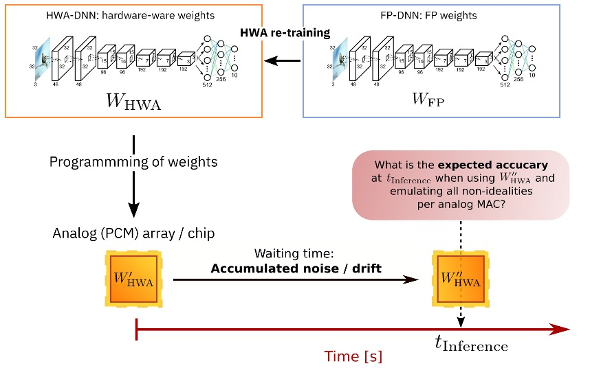
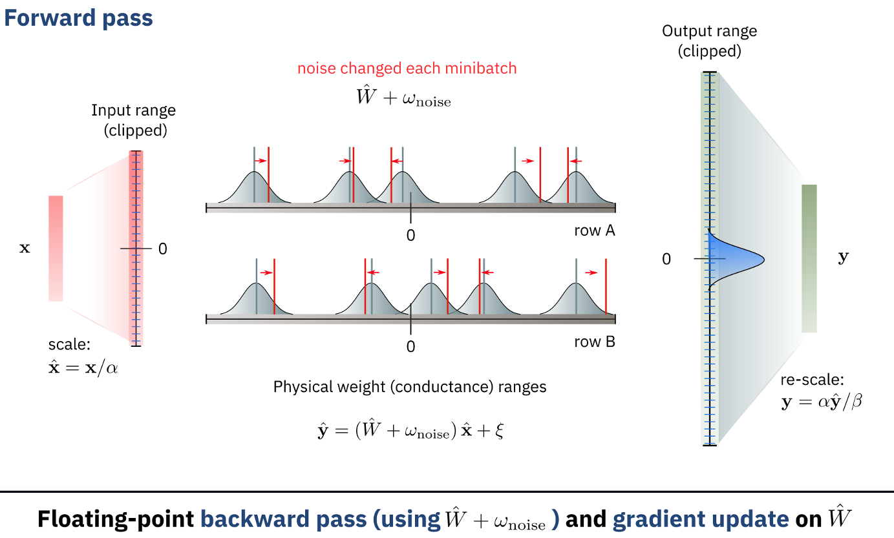

Analog Hardware-aware Training
===================================

Introduction
------------
When performing inference on Analog hardware, direct transfer of the weights trained on a digital chip to analog hardware 
would results in reduced network accuracies due to non-idealities of the non-volatile memory technologies used in the analog chip. 
For example, a common non-ideality of Phase Change Memory is the resistance drift. This drift is due to structural relaxation of 
the physical material composing the memory and causes an evolution of the memory resistance over time, which translates in a change in 
the weight stored in the memory array. This would eventually result in a decrease network accuracy over time.
What one can do is to train the network on digital accelerator but in a way that is aware of the hardware characteristics that will be used 
in the inference pass, we refer to this as Hardware Aware Training (HWA).

Hardware-aware re-training greatly improves analog inference accuracy :ref:`[2] <references>`. This technique was also shown to be effective
for digital hardware. For example in the case of quantization-aware training. For Analog inference, the the network could be prepared or 
pretrained in digital with the usual deep learning training methods. The fully trained network is then programmed on the analog chip to accelerate 
inference. Due to the noisiness of the programming and the drifting of the conductance values over time for some of the materials, we need to evaluate 
the accuracy of the model for different time points after programming the weights on the analog chip.

The figure below shows how the noise can be added during the training in the forward pass:

InferenceRPUConfig
-------------------
The example below shows how you can define an analog tile configuration with options for hardware-aware training.::

    from aihwkit.simulator.configs import InferenceRPUConfig

    # Define the inference/hardware-aware training tile
    rpu_config = InferenceRPUConfig()

    # Define the analog model, e.g., by converting a given floating point (FP) model
    from torchvision.models import resnet34  # e.g., trained model from torch
    analog_model = convert_to_analog(resnet34(), rpu_config, weight_scaling_omega=1.0)

    # [... do hardware-aware (re)-training ...]

    # Evaluate the model after programming the weights and driting over a certain period of time 
    analog_model = AnalogSequential(analog_model).eval()
    t_inference = 1000 #desired time of drift in seconds after programming
    analog_model.drift_analog_weights(t_inference)

    # [... evaluate programmed drifted model ...]
    

Example of hardware-aware training with PCM noise model 
-------------------------------------------------------
The PCM noise model (see section :ref:`PCM-target`) can be used in our package
in the following way. Instead of using a regular analog tile, that is catered
to doing training on analog with pulsed update and others (see Section
:ref:`using-simulator-analog-tiles`), you can use an _inference_ tile that
only has non-idealities in the forward pass, but a perfect update and
backward pass. Moreover, for inference, weights can be subject to
realistic weight noise and drift as described above. To enable this
inference features, one has to build an model using our
:class:`~aihwkit.simulator.tiles.inference.InferenceTile` (see also
`example 5 <https://github.com/IBM/aihwkit/blob/master/examples/05_simple_layer_hardware_aware.py>`_)::

    from aihwkit.simulator.configs import InferenceRPUConfig
    from aihwkit.simulator.configs.utils import WeightNoiseType
    from aihwkit.inference import PCMLikeNoiseModel, GlobalDriftCompensation

    # Define a single-layer network, using inference/hardware-aware training tile
    rpu_config = InferenceRPUConfig()

    # specify additional options of the non-idealities in forward to your liking
    rpu_config.forward.inp_res = 1/64.  # 6-bit DAC discretization.
    rpu_config.forward.out_res = 1/256. # 8-bit ADC discretization.
    rpu_config.forward.w_noise_type = WeightNoiseType.ADDITIVE_CONSTANT
    rpu_config.forward.w_noise = 0.02   # Some short-term w-noise.
    rpu_config.forward.out_noise = 0.02 # Some output noise.

    # specify the noise model to be used for inference only
    rpu_config.noise_model = PCMLikeNoiseModel(g_max=25.0) # the model described

    # specify the drift compensation
    rpu_config.drift_compensation = GlobalDriftCompensation()

    # build the model (here just one simple linear layer)
    model = AnalogLinear(4, 2, rpu_config=rpu_config)

Once the DNN is trained (automatically using hardware-aware training, if the forward
pass has some non-idealities and noise included), then the inference
with drift and drift compensation is done in the following manner::

    model.eval()        # model needs to be in inference mode
    t_inference = 3600. # time of inference in seconds (after programming)

    program_analog_weights(model) # can also omitted as it is called below in any case
    drift_analog_weights(model, t_inference) # modifies weights according to noise model

    # now the model can be evaluated with programmed/drifted/compensated weights

Note that we here have two types of non-linearities included.  For the
first, longer-term weight noise and drift (as described above), we assume
that during the evaluation the weight related PCM noise and the drift
is done once and then weights are kept constant. Thus, a subsequent
test error calculation over the full test set would signify the
`expected` test error for the model at a given time. Ideally, one would
want to repeat this for different weight noise and drift instance and
or different inference times to access the accuracy degradation
properly.

The second type of non-idealities are short-term and on the level of
a single analog MACC (Multiply and Accumulate). Noise on that level vary
with each usage of the analog tile and are specified in the
``rpu_config.forward``.

For details on the implementation of our inference noise model, please
consult :class:`~aihwkit.inference.noise.pcm.PCMLikeNoiseModel`. In
particular, we use a
:class:`~aihwkit.inference.converter.conductance.SinglePairConductanceConverter`
to convert weights into conductance paris and then apply the noise pn
both of these pairs. More elaborate mapping schemes can be
incorporated by extending
:class:`~aihwkit.inference.converter.base.BaseConductanceConverter`.
