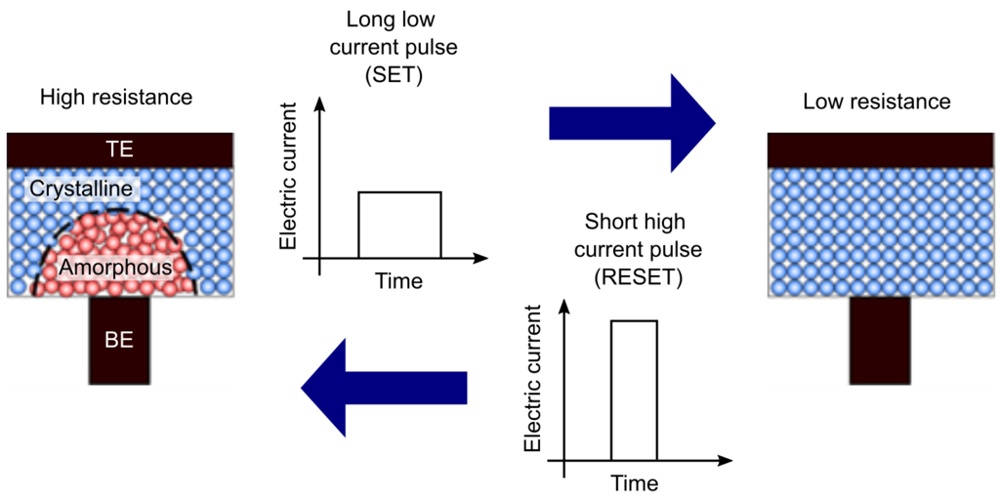
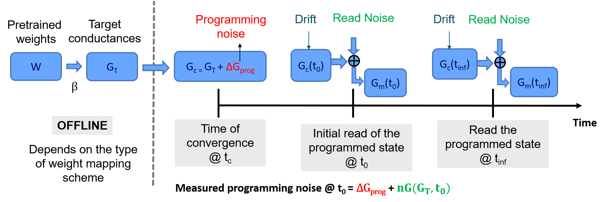
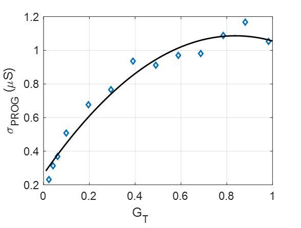
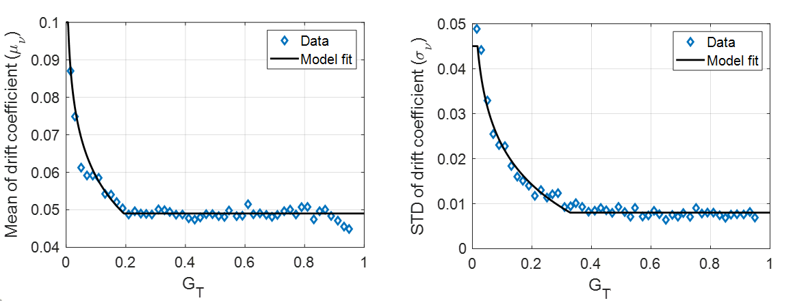
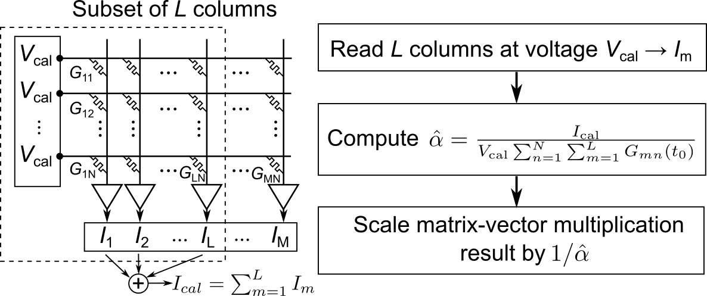
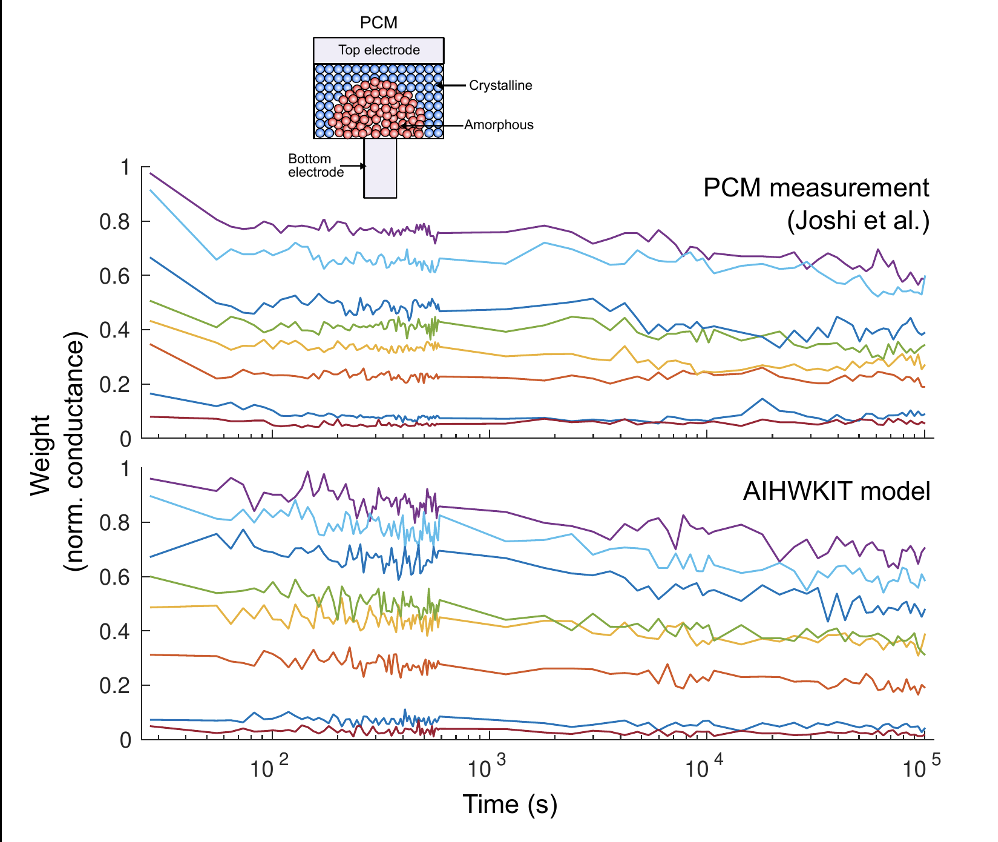

.. _PCM-target:

Inference and PCM Statistical Model
===================================

The analog AI hardware kit provides a state-of-the-art statistical model of a
phase-change memory (PCM) array that can be used when performing inference to
simulate the various sources of noise that are present in a real hardware
:ref:`[1] <references_pcm>`.
This model is calibrated based on extensive measurements performed on an array
containing 1 million PCM devices fabricated at IBM :ref:`[2] <references_pcm>`.

PCM is a key enabling technology for non-volatile electrical data storage at the
nanometer scale, which can be used for analog AI :ref:`[3] <references_pcm>`.
A PCM device consists of a
small active volume of phase-change material sandwiched between two electrodes.
In PCM, data is stored by using the electrical resistance contrast between a
high-conductive crystalline phase and a low-conductive amorphous phase of the
phase-change material. The phase-change material can be switched from low to
high conductive state, and vice-versa, through applying electrical current
pulses. The stored data can be retrieved by measuring the electrical resistance
of the PCM device. An appealing attribute of PCM is that the stored data is
retained for a very long time (typically 10 years at room temperature), but is
written in only a few nanoseconds.

The model simulates three different sources of noise from the PCM array:
programming noise, read noise and temporal drift.
The model is only used during inference and therefore it is assumed that network
weights have been trained beforehand in software. The diagram below explains
how these three sources of noise are incorporated during inference when using
the statistical model:

Mapping the trained weights to target conductances
--------------------------------------------------

This step is typically done offline, after training, before programming the
hardware. When the final converged network weights :math:`W` have been
obtained after training, they must be converted to target conductance values
:math:`G_T` that will be programmed on the hardware, within the range that it
supports. In the statistical model, this range is set to :math:`[0,1]`, where
:math:`1` corresponds to the largest conductance value :math:`g_\text{max}` that
can be reliably programmed on the hardware.

The statistical model assumes that each weight is programmed on two PCM devices
in a differential configuration. That is, depending on the sign of the weight,
either the device encoding the positive part of the weight or the negative part
is programmed, and the other device is set to 0. Thus, the simplest way to map
the weights to conductances is to multiply the weights by scaling factor
:math:`\beta`, which is different for every network layer. A simple approach is
to use :math:`\beta = 1/w_\text{max}`, where :math:`w_\text{max}` is the maximum
absolute weight value of a layer.

Programming noise
-----------------

After the target conductances have been defined, they are programmed on the PCM
devices of the hardware using a closed-loop iterative write-read-verify scheme
:ref:`[4] <references_pcm>`.
The conductance values programmed in this way on the hardware will have a
certain error compared with the target values. This error is characterized by
the programming noise. The programming noise is modeled based on the standard
deviation of the iteratively programmed conductance values measured from
hardware.

The equations used in the statistical model to implement the programming noise
are (where we use small letters for the elements of the matrices
:math:`W` and :math:`G_T`, etc., and omit the indeces for brevity):

.. math::

    g_\text{prog} = g_{T} + {\cal N}(0,\sigma_\text{prog})

.. math::

    \sigma_\text{prog} = \max\left(-1.1731 \, g_{T}^2 +
    1.9650 \, g_{T} + 0.2635, 0 \right)

The fit between this equation and the hardware measurement is shown below:

Drift
-----

After they have been programmed, the conductance values of PCM devices drift
over time. This drift is an intrinsic property of the phase-change material of
a PCM device and is due to structural relaxation of the amorphous phase
:ref:`[5] <references_pcm>`.
Knowing the conductance at time :math:`t_c` from the last programming pulse,
:math:`g_\text{prog}`, the conductance evolution can be modeled as:

.. math::

    g_\text{drift}(t) = g_\text{prog} \left(\frac{t}{t_c}\right)^{-\nu}

where :math:`\nu` is the so-called drift exponent and is sampled from
:math:`{\cal N}(\mu_\nu,\sigma_\nu)`.  :math:`\nu` exhibits
variability across a PCM array and a dependence on the target
conductance state :math:`g_T`. The mean drift exponent :math:`\mu_\nu`
and its standard deviation :math:`\sigma_\nu` measured from hardware
can be modeled with the following equations:

.. math::
   :nowrap:

   \begin{eqnarray*}
   \mu_\nu &=& \min\left(\max\left(-0.0155 \log (g_T) + 0.0244, 0.049\right), 0.1\right)\\
   \sigma_\nu &=& \min\left(\max\left(-0.0125 \log (g_T) - 0.0059,
   0.008\right), 0.045\right)\\
   \end{eqnarray*}

The fits between these equations and the hardware measurements are shown below:

Read noise
----------

When performing a matrix-vector multiplication with the in-memory computing
hardware, after the weights have been programmed, there will be instantaneous
fluctuations on the hardware conductances due to the intrinsic noise from the
PCM devices. PCM exhibits :math:`1/f` noise and random telegraph noise
characteristics, which alter the effective conductance values used for
computation. This noise is referred to as read noise, because it occurs when
the devices are read after they have been programmed.

The power spectral density :math:`S_G` of the :math:`1/f` noise in PCM is
given by the following relationship:

.. math::

    S_G/G^2 = Q/f

The standard deviation of the read noise :math:`\sigma_{nG}` at time :math:`t`
is obtained by integrating the above equation over the measurement bandwidth:

.. math::

    σ_{nG}(t) = g_\text{drift}(t)  Q_s  \sqrt{\log\frac{t+t_\text{read}}{2 t_\text{read}}}

where :math:`t_\text{read} = 250` ns is the width of the pulse applied when reading
the devices.

The :math:`Q_s` measured from the PCM devices as a function of :math:`g_T`
is given by:

.. math::

    Q_s=\min\left(0.0088/g_T^{0.65}, 0.2\right)

The final simulated PCM conductance from the model at time :math:`t`, :math:`g(t)`, is
given by:

.. math::

    g(t)= g_\text{drift} (t)+ {\cal N}\left(0, \sigma_{nG} (t)\right)

Compensation method to mitigate the effect of drift
---------------------------------------------------

The conductance drift of PCM devices can have a very detrimental effect on the
inference performance of a model mapped to hardware. This is because the
magnitude of the PCM weights gradually reduces over time due to drift and this
prevents the activations from properly propagating throughout the network. A
simple global scaling calibration procedure can be used to compensate for the
effect of drift on the matrix-vector multiplications performed with PCM
crossbars.
As proposed in :ref:`[5] <references_pcm>`, the summed current of a subset of
the columns in the array can be periodically read over time at a constant
voltage. The resulting total current is then divided by the summed current of
the same columns but read at time :math:`t_0`. This results in a single scaling
factor, :math:`\hat{\alpha}`, that can be applied to the output of the entire
crossbar in order to compensate for a global conductance shift.

The figure below explains how the drift calibration procedure can be performed
in hardware:

In the simulator, we implement drift compensation by performing a forward pass
with an all 1-vector as an input, and then summing outputs (using the potential
non-idealities defined for the forward pass) in an absolute way.
This procedure is done once after programming and once after applying the drift
expected as time point of inference :math:`t_\text{inference}`. The ratio of the
two numbers is the global drift compensation scaling factor of that layer, and
it is applied (in digital) to the (digital) output of the analog tile.

Note that the drift compensation class
:class:`~aihwkit.inference.compensation.base.BaseDriftCompensation` is user
extendable, so that new drift compensation methods can be added
easily.

PCM model in aihwkit
--------------------
We constructed statistical noise models for phase change materials to realistically simulate the expected programming error and 
conductance drift over time for such inference hardware using PCM. Here the experimental data is compared against the model 
implemented noise models which show a great correspondence. We also implemented a drift compensation that increasingly scales 
the output of the Analog tiles in digital to compensate for the reduction of the conductance. (See figure below)

.. _references_pcm:

References
----------

* [1] Nandakumar, S. R., Boybat, I., Joshi, V., Piveteau, C., Le Gallo, M., Rajendran, B., ... & Eleftheriou, E. `Phase-change memory models for deep learning training and inference <https://ieeexplore.ieee.org/abstract/document/8964852>`_. In 26th IEEE International Conference on Electronics, Circuits and Systems (ICECS) (pp. 727-730). 2019

* [2] Joshi, V., Le Gallo, M., Haefeli, S., Boybat, I., Nandakumar, S. R., Piveteau, C., ... & Eleftheriou, E. `Accurate deep neural network inference using computational phase-change memory <https://www.nature.com/articles/s41467-020-16108-9>`_. Nature Communications, 11, 2473. 2020

* [3] Le Gallo, M., & Sebastian, A. `An overview of phase-change memory device physics <https://iopscience.iop.org/article/10.1088/1361-6463/ab7794/meta>`_. Journal of Physics D: Applied Physics, 53(21), 213002. 2020

* [4] Papandreou, N., Pozidis, H., Pantazi, A., Sebastian, A., Breitwisch, M., Lam, C., & Eleftheriou, E. `Programming algorithms for multilevel phase-change memory <https://ieeexplore.ieee.org/abstract/document/5937569>`_. In IEEE International Symposium of Circuits and Systems (ISCAS) (pp. 329-332). 2011

* [5] Le Gallo, M., Krebs, D., Zipoli, F., Salinga, M., & Sebastian, A. `Collective Structural Relaxation in Phase‐Change Memory Devices <https://onlinelibrary.wiley.com/doi/full/10.1002/aelm.201700627>`_. Advanced Electronic Materials, 4(9), 1700627. 2018

* [6] Le Gallo, M., Sebastian, A., Cherubini, G., Giefers, H., & Eleftheriou, E. `Compressed sensing with approximate message passing using in-memory computing <https://ieeexplore.ieee.org/abstract/document/8450603>`_. IEEE Transactions on Electron Devices, 65(10), 4304-4312. 2018
