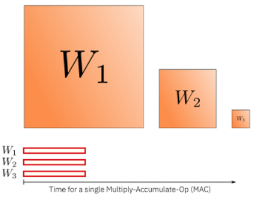
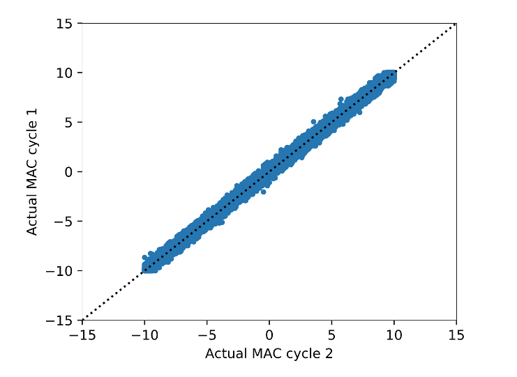

Advantages and Challenges
=========================
Why is computation in analog interesting for AI acceleration. There are several advantages and challenges.
First, due to the parallel in-memory compute, the matrix vector product is very power efficient as the weights data does not need to 
be fetched from memory for each operation. Second, because the analog matrix vector product is performed using the laws of electro-physics, 
it is computed in constant time. This implies that a large weight matrix needs in first approximations the same time to compute the matrix 
vector product as when using a smaller matrix. This is not the case for conventional digital MAC operations, where the time to compute 
the matrix vector product typically scales with the number of matrix elements as illustrated in the figure below.

With all these great advantages, comes also key challenges for analog AI accelerators. Most importantly, the analog vector product is not exact. 
There are many possible noise sources and non-idealities. For instance, as shown in the graph below, repeating the same matrix vector product twice, 
will result in a slightly different outcome. This is the main motivation behind developing a flexible simulation tool for Analog accelerators as there 
is a need to investigate whether we can achieve acceptable accuracies when we accelerate important AI workloads with these future Analog chips. 
Additionally, a simulation tool that simulates the expected noise sources of the analog compute, will also help to develop new algorithms or error 
compensation methods to improve the accuracy and reduce any potential impact of the expected non-idealities of Analog compute. 

