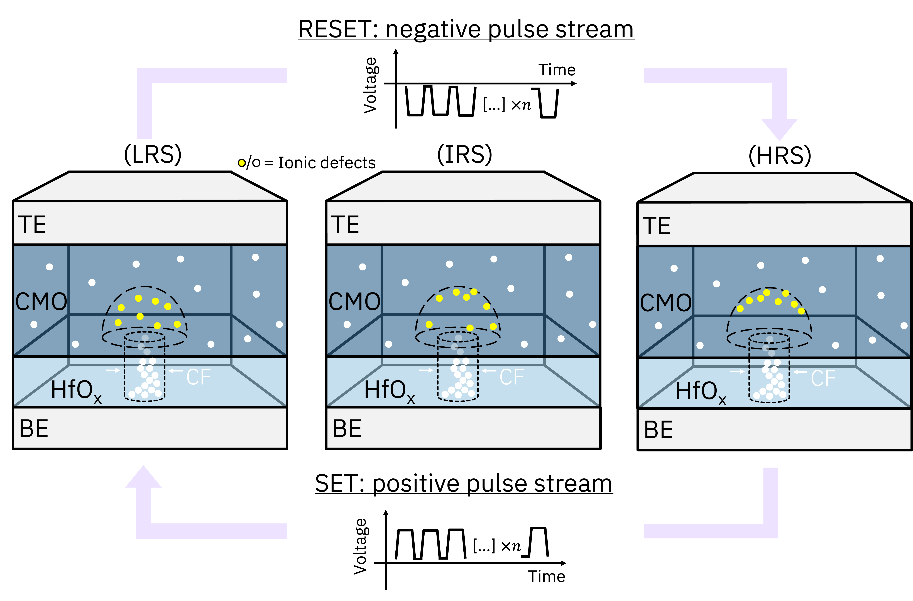
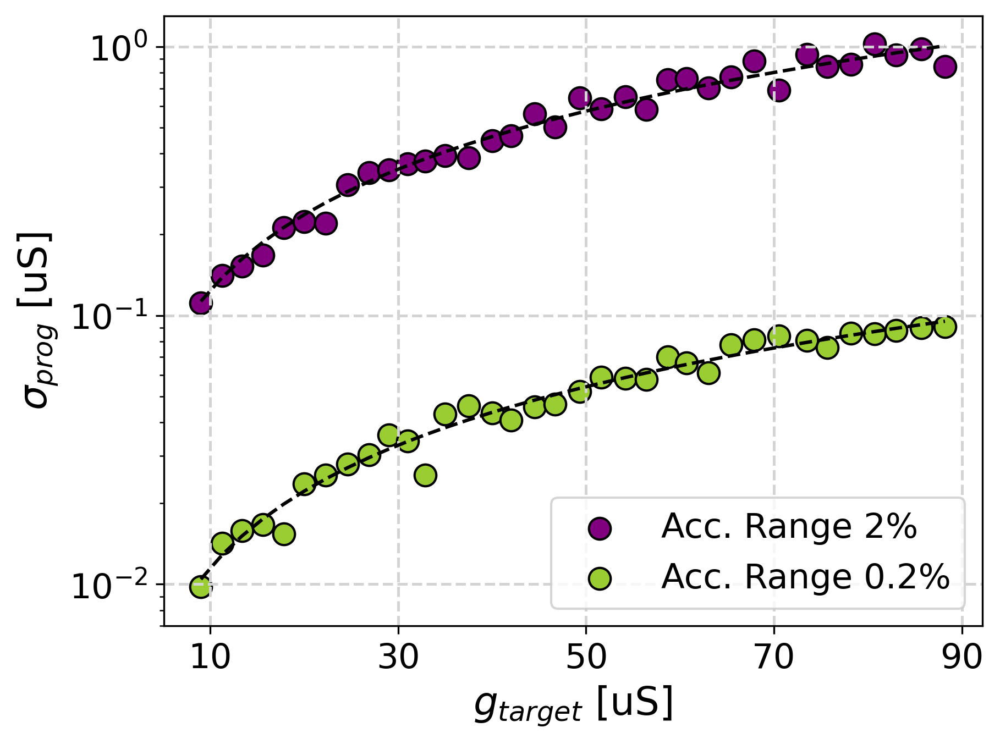
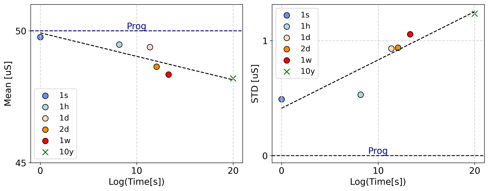
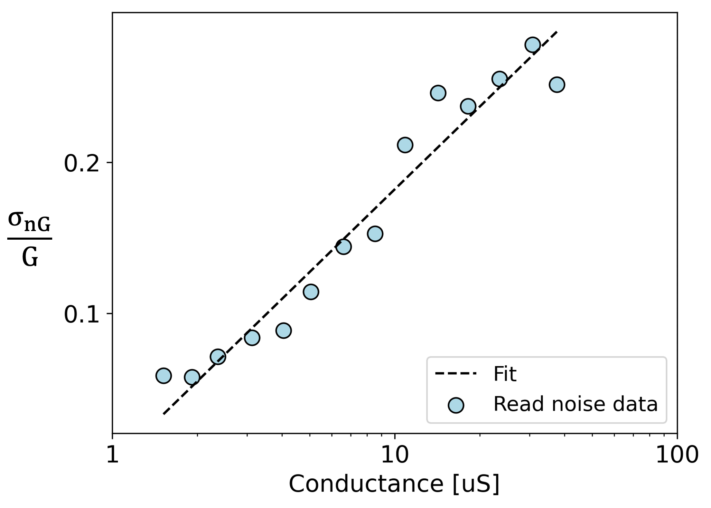

.. _ReRAM-target:

Inference with Analog CMO-ReRAM Statistical Model
===================================

The Analog AI Hardware Kit includes a statistical model for simulating the behavior of a resistive random-access memory (ReRAM) array during inference. This model accounts for various noise sources and non-idealities in real hardware, providing a realistic evaluation of inference accuracy under practical conditions. It is calibrated using measurements from analog filamentary Conductive Metal Oxide/HfOx-ReRAM (CMO-ReRAM) arrays fabricated at IBM 
:ref:`[1] <references_reram>` :ref:`[2] <references_reram>`, ensuring it reflects the characteristics of actual devices.

Conventional ReRAM relies on the redox reactions within the conductive filament (CF) tunneling gap in the HfOx layer, resulting in the well-known abrupt switching characteristics. 
In contrast, the analog filamentary CMO-ReRAM operates on a different principle, with the modulation of defect states within the sub-band of the CMO layer playing a crucial role in its switching :ref:`[3] <references_reram>` :ref:`[4] <references_reram>` :ref:`[5] <references_reram>`. In this case, the CF plays a minimal role after the initial electroforming. During the RESET (from low to high resistance) process in CMO-ReRAM, oxygen vacancies migrate radially away from the conductive filament, depleting a semi-spherical volume referred to as the dome. This leads to a reduction in defect state density in the CMO layer, resulting in a high-resistance state. Conversely, during the SET (from high to low resistance) process, a local enrichment of defects occurs within the dome in the CMO layer, thus restoring the low-resistance state. Notably, various intermediate resistance states (IRS) can be achieved depending on the number of voltage pulses applied in both directions :ref:`[3] <references_reram>` :ref:`[4] <references_reram>` :ref:`[6] <references_reram>`.

The model simulates three different sources of noise in the CMO-ReRAM array: programming noise, read noise, and temporal drift. The model is used only during inference, assuming that the network weights have been trained beforehand in software using dedicated training algorithm (e.g. SGD or Tiki-Taka) :ref:`[7] <references_reram>`.

Pre-trained weights are normalized first into a :math:`[-1,1]` range, where:math:`-1` corresponds to the HRS, i.e. :math:`g_\text{min}`, and :math:`1` to the LRS, i.e. :math:`g_\text{max}`. Each weight is programmed into a single device due to the bidirectional switching capabilities of analog ReRAM devices. This statistical noise model assumes a minimum conductance level of 8 :math:`\mu S` and a maximum conductance level of 90 :math:`\mu S` :ref:`[1] <references_reram>`.

Programming noise
-----------------

Conductance levels are reached by following an identical-pulse closed-loop scheme :ref:`[1] <references_reram>`. The iterative process stops once the programmed conductance converges to the target value within a defined acceptance range and introduces an error due to the analog nature of conductance weights. The error is described by a normal distribution defined by a standard deviation referred to as programming noise.

.. math::

    g_\text{prog} = g_\text{target} + {\cal N}(0,\sigma_\text{prog})

The programming noise magnitude is defined by the acceptance range, where a narrower acceptance can improve programming precision at the cost of increasing the number of iterations for converging to the target conductance level. The statistical characterization of the CMO-ReRAM devices considered two representative acceptance range intervals: 0.2% and 2% of :math:`g_\text{target}`.  The extracted programming noise model shows a linear relationship with respect to the target conductance for both acceptance ranges, fitted with the following equations :ref:`[1] <references_reram>`:

.. math::
    :nowrap:

    \begin{eqnarray*}
    \sigma_\text{prog}(0.2\%) = 1.0687 \: g_\text{target} \: [\mu S] + 0.811 \: [nS]\\
    \sigma_\text{prog}(2\%) = 11.2902 \: g_\text{target} \: [\mu S] + 11.218 \: [nS] \\
    \end{eqnarray*}

The fits of the equations above and the experimental data are shown below:

Drift
----

In analog ReRAM devices, a significant conductance relaxation has been observed immediately after programming (within few seconds). Following this initial abrupt conductance change, the relaxation process slows considerably. The drifted conductance level is defined as:

.. math::

    g_\text{drift} = {\cal N}(\mu_\text{drift},\sigma_\text{drift})

Described by a Gaussian distribution with mean :math:`\mu_\text{drift}` and standard deviation :math:`\sigma_\text{drift}`. In contrast to other resistive memory devices, the characterization of conductance relaxation in CMO-ReRAM devices showed independence from the target conductance level :ref:`[1] <references_reram>`. Therefore, the time dependency of the drift was extracted for a reference conductance level of 50 :math:`\mu S` among devices. 
The mean and standard deviation of the drift showed a decrease and increase with the logarithm of the time, respectively. The fitted equations to model the mean and the standard deviation are defined as:

.. math::
    :nowrap:

    \begin{eqnarray*}
    \mu_\text{drift} = g_{prog} - 0.089 \log (t) \: [\mu S]\\
    \sigma_\text{drift} = 0.042 \log (t) + 0.4118 \: [\mu S]\\
    \end{eqnarray*}

The fit of the experimental data and the euqtions is shown below:

Read noise
----------

The last source of noise in CMO-ReRAM devices is :math:`1/f` noise and random telegraph noise, also referred to as read noise :ref:`[2] <references_reram>`. The obtained conductance after the three sources of variation is:

.. math::

    g(t) = g_\text{drift} + {\cal N}(0,\sigma_\text{nG})

The read noise standard deviation (:math:`\sigma_\text{nG}`) in CMO-ReRAM device showed a logarithmic dependency on the conductance level for the given conductance range ([8 , 90] :math:`\mu S`). The read noise then depends on the target conductance level and the logarithm of the time after programming. The statistical characterization of the noise was performed using read pulses of :math:`1 \mu s`. The fitted model is described by the following equation:

.. math::

    σ_{nG}(t) = 0.0277 \: \log (g_\text{drift}(t)) \: \sqrt{\log\frac{t+t_\text{read}}{2 t_\text{read}}}

The fitting between the empirical data and the fitting for a time of inference of 10 s is shown below:

.. _references_reram:

References
----------

* [1] Falcone, D. F., Clerico, V., Choi, W., Stecconi, T., Horst, F., Begon-Lours, L., Galetta, M., Porta, A. L., Garg, N., Alibart, F., Offrein, B. J., & Bragaglia, V. `All-in-One Analog AI Accelerator: On-Chip Training and Inference with Conductive-Metal-Oxide/HfOx ReRAM Devices <https://arxiv.org/abs/2502.04524>`_.  Preprint. 2025

* [2] Lombardo, D. G. F., Ram, M. S., Stecconi, T., Choi, W., Porta, A. L., Falcone, D. F., Offrein, B., & Bragaglia, V. `Read Noise Analysis in Analog Conductive-Metal-Oxide/HfOx ReRAM Devices <https://doi.org/10.1109/DRC61706.2024.10643760>`_.Device Research Conference (DRC), 1–2. 2024

* [3] Falcone, D. F., Menzel, S., Stecconi, T., Galetta, M., La Porta, A., Offrein, B. J., & Bragaglia, V. `Analytical modelling of the transport in analog filamentary conductive-metal-oxide/HfOx ReRAM devices <https://doi.org/10.1039/D4NH00072B>`_. Nanoscale Horiz., 9(5), 775–784. 2024

* [4] Falcone, D. F., Menzel, S., Stecconi, T., Porta, A. L., Carraria-Martinotti, L., Offrein, B. J., & Bragaglia, V. `Physical modeling and design rules of analog Conductive Metal Oxide-HfO2 ReRAM <https://doi.org/10.1109/IMW56887.2023.10145936>`_. IEEE International Memory Workshop (IMW), 1–4. 2023 

* [5] Stecconi, T., Guido, R., Berchialla, L., La Porta, A., Weiss, J.R., Popoff, Y., Halter, M., Sousa, M., Horst, F., Dávila, D., Drechsler, U., Dittmann, R., Offrein, B.J., & Bragaglia, V. `Filamentary TaOx/HfO2 ReRAM Devices for Neural Networks Training with Analog In‐Memory Computing <https://api.semanticscholar.org/CorpusID:250434669>`_. Advanced Electronic Materials, 8. 2022
  
* [6] Galetta, M., Falcone, D. F., Menzel, S., Porta, A. L., Stecconi, T., Choi,
  W., Offrein, B. J., & Bragaglia, V. `Compact Model of Conductive-Metal-Oxide/HfOx Analog Filamentary ReRAM Devices <https://doi.org/10.1109/ESSERC62670.2024.10719489>`_. IEEE European Solid-State Electronics Research Conference (ESSERC), 749–752. 2024

* [7] Stecconi, T., Bragaglia, V., Rasch, M., Carta, F., Horst, F., Falcone, D., Kate, S., Gong, N., Ando, T., Olziersky, A., & Offrein, B. J. `Analog Resistive Switching Devices for Training Deep Neural Networks with the Novel Tiki-Taka Algorithm <https://doi.org/10.1021/acs.nanolett.3c03697>`_. Nano Letters, 24. 2024
