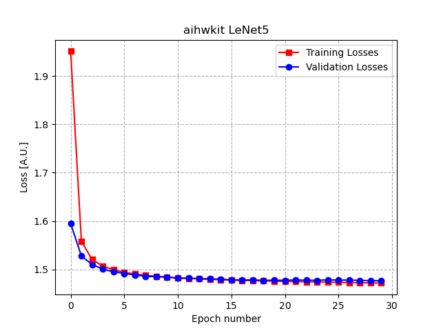
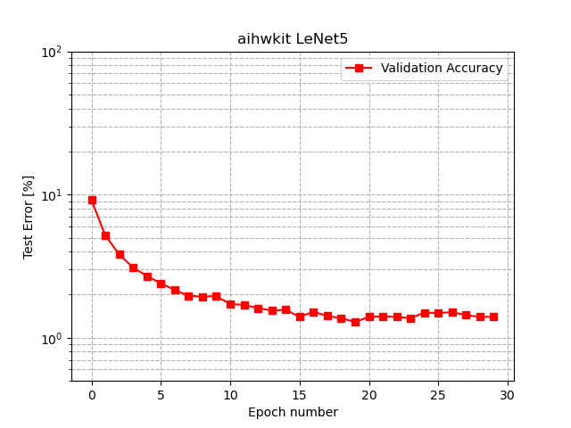
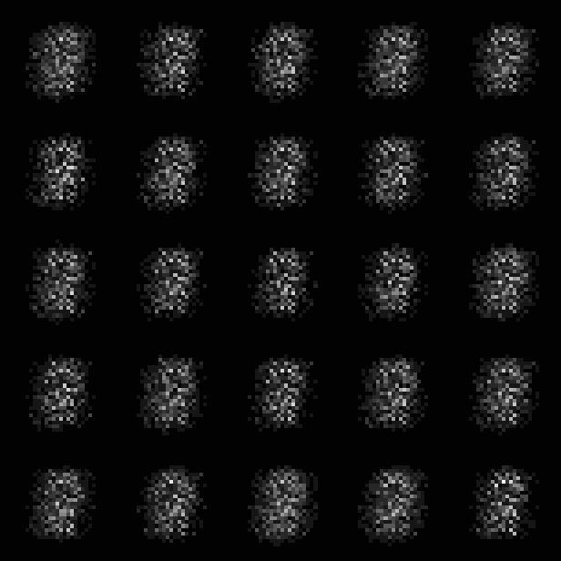

# IBM Analog Hardware Acceleration Kit: Examples

We have many different examples to explore the many features of the IBM Analog Hardware
Acceleration Kit:

## Example 1: [`01_simple_layer.py`]

In this example a single fully connected analog layer is used to predict the output tensor y, based
on the input tensor x. The `rpu_config parameter` of the `AnalogLinear` layer can be used  to
define different settings for the network. In this case it specifies the device
`ConstantStepDevice`, but different [Resistive Processing Units] exist:

```python
# Define a single-layer network, using a constant step device type.
rpu_config = SingleRPUConfig(device=ConstantStepDevice())
model = AnalogLinear(4, 2, bias=True,
                     rpu_config=rpu_config)

```

In the first few examples both training and inference are done on an analog chip, while few of the
later examples will use the Hardware Aware (HWA) training. HWA training uses digital chip for the
training part and analog one for the inference one. The network is trained for 100 epochs using
the analog Stochastic Gradient Descent and the loss is printed for every epoch:

```
Loss error: 0.5686419010162354
...
Loss error: 0.0137629760429263

Process finished with exit code 0
```

## Example 2: [`02_multiple_layer.py`]

The second example uses a larger fully connected network to predict the output tensor y based on
the input tensor x. In this network the multiple fully connected analog layer are wrapped by a
sequential container. Similarly to the first example, the network uses a `ConstantStepDevice` and
it is  trained for 100 epochs with the loss printed at every epoch.

## Example 3: [`03_minst_training.py`]

This MNIST training example is based on the paper: [Gokmen T and Vlasov Y (2016) Acceleration of
Deep Neural Network Training with Resistive Cross-Point Devices: Design Considerations. Front.
Neurosci.].
It builds a deep neural network of fully connected layers with 784, 256, 128 and 10 neurons,
sigmoids and softmax activation functions.

```
Sequential(
  (0): AnalogLinear(in_features=784, out_features=256, bias=True, is_cuda=False)
  (1): Sigmoid()
  (2): AnalogLinear(in_features=256, out_features=128, bias=True, is_cuda=False)
  (3): Sigmoid()
  (4): AnalogLinear(in_features=128, out_features=10, bias=True, is_cuda=False)
  (5): LogSoftmax()
)
```

The device used in the analog tile is a `ConstantStepDevice`. The network is trained with a
standard MNIST dataset with a Stochastic Gradient Descent optimizer. The network is trained for 30
epochs with batch size of 64 and a fixed learning rate of 0.05 and the loss is printed at every
epoch.

## Example 4: [`04_lenet5_training.py`]

This CNN MNIST training example is based on the paper: [Gokmen T, Onen M and Haensch W (2017)
Training Deep Convolutional Neural Networks with Resistive Cross-Point Devices. Front. Neurosci.].
It is a deep neural network of convolutional layers with an architecture similar to LeNet5.
It has 2 convolutional layers with 5x5 kernels, tanh and softmax activation functions and uses
max-pooling as subsampling layer. The full architecture is printed in terminal during execution:

```
LeNet5(
  (feature_extractor): Sequential(
    (0): AnalogConv2d(1, 16, kernel_size=(5, 5), stride=(1, 1))
    (1): Tanh()
    (2): MaxPool2d(kernel_size=2, stride=2, padding=0, dilation=1, ceil_mode=False)
    (3): AnalogConv2d(16, 32, kernel_size=(5, 5), stride=(1, 1))
    (4): Tanh()
    (5): MaxPool2d(kernel_size=2, stride=2, padding=0, dilation=1, ceil_mode=False)
    (6): Tanh()
  )
  (classifier): Sequential(
    (0): AnalogLinear(in_features=512, out_features=128, bias=True, is_cuda=True)
    (1): Tanh()
    (2): AnalogLinear(in_features=128, out_features=10, bias=True, is_cuda=True)
  )
)
```

This example can be used to evaluate the accuracy difference between training with an analog
network (specified by `ConstantStepDevice`) or a digital network (specified by
`FloatingPointDevice`), by selecting the proper `SingleRPUConfig` definition:

```python
# Select the device model to use in the training.
# * If `SingleRPUConfig(device=ConstantStepDevice())` then analog tiles with
#   constant step devices will be used,
# * If `FloatingPointRPUConfig(device=FloatingPointDevice())` then standard
#   floating point devices will be used
RPU_CONFIG = SingleRPUConfig(device=ConstantStepDevice())
# RPU_CONFIG = FloatingPointRPUConfig(device=FloatingPointDevice())
```

The CNN is trained for 30 epochs with a batch size of 8, a Stochastic Gradient Descent optimizer
and a learning rate of 0.01. When training on GPU (V100) it takes ~20s/epoch to train the network;
when working with CPU, the time required for training with a `ConstantSetpDevice` is substantially
longer (on a standard laptop ~5min/epoch) than `FloatingPointDevice` is used. The timestamp,
losses, test error and accuracy are printed for every epoch:

```
10:20:13 --- Started LeNet5 Example
10:20:32 --- Epoch: 0	Train loss: 1.9803	Valid loss: 1.6184	Test error: 10.66%	Accuracy: 89.34%
...
10:29:27 --- Epoch: 29	Train loss: 1.4724	Valid loss: 1.4768	Test error: 1.32%	Accuracy: 98.68%
10:29:27 --- Completed LeNet5 Example
```

At the end of the training/evaluation phases of the network, the losses, accuracy and test_error
are also saved to file in a `results/LENET5/` folder (from the path where the example was
executed) together with a plot that shows the training evolution over the multiple epochs.





## Example 5: [`05_simple_layer_hardware_aware.py`]

Templating from the example 1, this example use the same input/output tensors and same architecture,
but uses the hardware aware training functionality. In hardware aware training the network training
is performed on a digital network, with many noise sources typical of Phase Change Memory (PCM)
inserted in this phase to make the network more resilient to these. The inference part is instead
performed on the analog network to take full advantage of the speed of the analog computation.
Many features and parameters can be defined in the `rpu_config` to specify the noise sources
characteristics:

```python
# Define a single-layer network, using inference/hardware-aware training tile
rpu_config = InferenceRPUConfig()
rpu_config.forward.out_res = -1.  # Turn off (output) ADC discretization.
rpu_config.forward.w_noise_type = WeightNoiseType.ADDITIVE_CONSTANT
rpu_config.forward.w_noise = 0.02  # Short-term w-noise.

rpu_config.clip.type = WeightClipType.FIXED_VALUE
rpu_config.clip.fixed_value = 1.0
rpu_config.modifier.pdrop = 0.03  # Drop connect.
rpu_config.modifier.type = WeightModifierType.ADD_NORMAL  # Fwd/bwd weight noise.
rpu_config.modifier.std_dev = 0.1
rpu_config.modifier.rel_to_actual_wmax = True

# Inference noise model.
rpu_config.noise_model = PCMLikeNoiseModel(g_max=25.0)
```
Additionally this example explore the use of `drift_compensation` methods to improve the accuracy
of the analog network during the inference phase in presence of [weight drift]. The
`drift_compensation` is also specified in the `rpu_config` option:

```python
# drift compensation
rpu_config.drift_compensation = GlobalDriftCompensation()
```
The weight drift is exercised through the drift_analog_weights function that is applied to the
analog model, and it can be looped over to explore inference accuracy at different times since
training:

```python
for t_inference in [0., 1., 20., 1000., 1e5]:
    model.drift_analog_weights(t_inference)
    pred_drift = model(x)
    print('Prediction after drift (t={}, correction={:1.3f}):\t {}'.format(
        t_inference, model.analog_tile.alpha.cpu().numpy(),
        pred_drift.detach().cpu().numpy().flatten()))
```

More details are discussed in the [Inference and PCM statistical model] documentation.

## Example 6: [`06_lenet5_hardware_aware.py`]

This example templates from the CNN of example 4 and add noise and non-idealities typical of the
PCM.

```python
# Define the properties of the neural network in terms of noise simulated during
# the inference/training pass
RPU_CONFIG = InferenceRPUConfig()
RPU_CONFIG.forward.out_res = -1.  # Turn off (output) ADC discretization.
RPU_CONFIG.forward.w_noise_type = WeightNoiseType.ADDITIVE_CONSTANT
RPU_CONFIG.forward.w_noise = 0.02
RPU_CONFIG.noise_model = PCMLikeNoiseModel(g_max=25.0)
```

As the previous example it then explores the effect of the PCM weight drift on the inference
accuracy:

```python
    # Simulation of inference pass at different times after training.
    for t_inference in [0., 1., 20., 1000., 1e5]:
        model.drift_analog_weights(t_inference)
```

## Example 7: [`07_simple_layer_with_other_devices.py`]

This example templates from example 1. However, rather than having a single device at every
cross-point of the RPU array it defines 3 different devices, each one with its specific parameters,
and the total weights is represented by the sum of the weights of these 3 devices:

```python
# 3 arbitrary single unit cell devices (of the same type) per cross-point.
rpu_config.device = VectorUnitCell(
    unit_cell_devices=[
        ConstantStepDevice(w_max=0.3),
        ConstantStepDevice(w_max_dtod=0.4),
        ConstantStepDevice(up_down_dtod=0.1),
    ])
```

The example also define the specific update policy that is used to learn the weights of the
network during the training phase. In this example the update is ony done on a single device which
is randomly selected among the 3:

```python
# Only one of the devices should receive a single update.
# That is selected randomly, the effective weights is the sum of all
# weights.
rpu_config.device.update_policy = VectorUnitCellUpdatePolicy.SINGLE_RANDOM
```

More information can be find in the [Unit Cell Device] documentation. Similarly to example 1 the
network is trained over 100 epochs with an analog Stochastic Gradient Descent optimizer and the
loss is printed for every epoch.

## Example 8: [`08_simple_layer_with_tiki_taka.py`]

This example aims at exploring a training algorithm specifically developed for RPU and resistive
device and discussed in [Gokmen T and Haensch W (2020) Algorithm for Training Neural Networks on
Resistive Device Arrays. Front. Neurosci.].
The Tiki-Taka algorithm relaxes the symmetricity requirements on the switching characteristic of
resistive devices used in RPU cross-point array. In this example 2 [Compound Device] are defined
at each crosspoint and the Tiki-Taka algorithm parameters are specified as part of the
```UnitCellRPUConfig```:

```python
# The Tiki-taka learning rule can be implemented using the transfer device.
rpu_config = UnitCellRPUConfig(
    device=TransferCompound(

        # Devices that compose the Tiki-taka compound.
        unit_cell_devices=[
            SoftBoundsDevice(w_min=-0.3, w_max=0.3),
            SoftBoundsDevice(w_min=-0.6, w_max=0.6)
        ],

        # Make some adjustments of the way Tiki-Taka is performed.
        units_in_mbatch=True,    # batch_size=1 anyway
        transfer_every=2,        # every 2 batches do a transfer-read
        n_cols_per_transfer=1,   # one forward read for each transfer
        gamma=0.0,               # all SGD weight in second device
        scale_transfer_lr=True,  # in relative terms to SGD LR
        transfer_lr=1.0,         # same transfer LR as for SGD
    )
)
```

Similarly to example 1 the network is trained over 100 epochs with an analog Stochastic Gradient
Descent optimizer and the loss is printed for every epoch.

## Example 9: [`09_simple_layer_deterministic_pulses.py`]

This example shows how to select different pulsing schemes for the analog update. By default, we
use stochastic pulses for activation and errors to update the devices with a step in up or down
direction only if pulses coincide at a crosspoint. Note that we indeed generate stochastic pulse
trains for each input line and thus do no short-cut in the simulation.

Here, in this example, we change the update to be performed using deterministic pulse trains that
yield always the same number of coincident pulses at a cross point, if the same inputs are
given. Implicitly, one can design the stored pulse train structure to quantize the input values in
a number of bins, which can be changed by the ``*_res_imilicit``  parameters.

```
rpu_config = SingleRPUConfig(device=ConstantStepDevice())
rpu_config.update.pulse_type = PulseType.DETERMINISTIC_IMPLICIT
rpu_config.update.desired_bl = 10 # max number in this case
rpu_config.update.update_bl_management = True # will vary up to 10 on demand
rpu_config.update.d_res_implicit = 0.1 # effective resolution of x bit lines
rpu_config.update.x_res_implicit = 0.1 # effective resolution of d bit lines

```
Similarly to example 1 the network is trained over 100 epochs with an analog Stochastic Gradient
Descent optimizer and the loss is printed for every epoch.

## Example 10: [`10_plot_presets.py`]

This example prints 5 of the different [`preset devices`] and [`preset configs`] available.
Using these presets makes easy to test the different memory elements that can be used to train a
neural network. The presets (except for the "Idealized analog device") are calibrated on the
measured characteristics of real hardware devices that have been fabricated at IBM. Device non-ideal
characteristics, noise, and variability are accurately simulated in all presets.

## Example 11: [`11_vgg8_training.py`]

This example train a VGG8 network on the Street View House Number (SVHN) dataset.
The device used in the `rpu_config` is the `GokmenVlasovPreset` config. In addition, it uses
weight scaling in the analog layers in order to improve the accuracy.

There are many built-in [`preset devices`] and corresponding [`preset configs`] which makes
convenient to explore the different memory element that can be used to train a neural network.
The presets (except for the "Idealized analog device") are calibrated on the measured
characteristics of real hardware devices that have been fabricated at IBM. Device non-ideal
characteristics, noise, and variability are accurately simulated in all presets.

## Example 12: [`12_simple_layer_with_mixed_precision.py`]

This example uses a single fully connected analog layer to predict the output tensor `y` based
on the input tensor `x` (using the same values and network structure as the example `01.`).
However, this example uses a custom RPU config for using a digital rank update and transfer to
analog device (as in mixed precision), set to a mixed precision compound which in turn uses
a `ConstantStep` analog device.

## Example 13: [`13_experiment_3fc.py`]

In this example the usage of the `Experiments` module is shown. A `BasicTraining` experiment
using three fully connected analog layers (based on the example `03`) is created, and executed
locally using the `LocalRunner`.

The `Experiments` module provides a convenient interface for running different types of experiments
by encapsulating the experiments in single classes.

## Example 14: [`14_experiment_custom_scheduler.py`]

This example illustrates how to customize the Experiments for adding new features. By subclassing
the base `BasicTraining` experiment used in example `13`, the training algorithm is modified in
order to support the use of a scheduler.

In particular, the new class specializes the `training()` function in order to create the
scheduler when the training is started, and the `training_step()` function in order to step the
scheduler every time an epoch is completed.

## Example 15: [`15_simple_lstm.py`]

This example performs hardware-aware training of an analog Long Short-Term Memory (LSTM)
network on a simple sequence. In hardware aware training, a digital network is trained using
noise sources typical of Phase Change Memory (PCM) in order to make the network more
resilient to noise sources. Inference is then performed using the analog LSTM
network to take full advantage of the speed and efficiency gains of the analog computation.
Hardware features can be defined using `rpu_config`:

```python
# Define a single-layer network, using inference/hardware-aware training tile
rpu_config = InferenceRPUConfig()
rpu_config.forward.out_res = -1.  # Turn off (output) ADC discretization.
rpu_config.forward.w_noise_type = WeightNoiseType.ADDITIVE_CONSTANT
rpu_config.forward.w_noise = 0.02  # Short-term w-noise.

rpu_config.clip.type = WeightClipType.FIXED_VALUE
rpu_config.clip.fixed_value = 1.0
rpu_config.modifier.pdrop = 0.03  # Drop connect.
rpu_config.modifier.type = WeightModifierType.ADD_NORMAL  # Fwd/bwd weight noise.
rpu_config.modifier.std_dev = 0.1
rpu_config.modifier.rel_to_actual_wmax = True

# Inference noise model.
rpu_config.noise_model = PCMLikeNoiseModel(g_max=25.0)
```

This example also demonstrates the efficacy of `drift_compensation` to improve the inference
accuracy of the analog LSTM network over time in presence of [weight drift]. The
`drift_compensation` method is also specified as an `rpu_config` option:

```python
# drift compensation
rpu_config.drift_compensation = GlobalDriftCompensation()
```
Weight drift is applied to the weights within the analog LSTM model using
the `drift_analog_weights` function. This function can be looped over to quantify the impact
of weight drift on inference accuracy over time:

```python
for t_inference in [0., 1., 20., 1000., 1e5]:
    model.drift_analog_weights(t_inference)
    states = reset_states()
    pred_drift, states = model(y_in, states)
```

More details on Phase Change Memory (PCM) noise sources and weight drift
can be found in the [Inference and PCM statistical model] documentation.

## Example 16: [`16_mnist_gan.py`]

This example depicts how to train a [Generative Adversarial Network (GAN)] using the `aihwkit`
package and its analog capabilities.

To do so, we implemented a very basic GAN architecture in which an analog generator learns to draw
characters, trying to mimic those appearing in the MNIST dataset. In contrast, a non-analog
discriminator tries to classify the generated images as fake or original (to give feedback to the
generator). The full architecture of the generator and the discriminator are printed in terminal
during execution:

```
Generator(
  (gen): AnalogSequential(
    (0): AnalogSequential(
      (0): AnalogLinear(in_features=64, out_features=128, bias=True)
      (1): BatchNorm1d(128, eps=1e-05, momentum=0.1, affine=True, track_running_stats=True)
      (2): ReLU(inplace=True)
    )
    (1): AnalogSequential(
      (0): AnalogLinear(in_features=128, out_features=256, bias=True)
      (1): BatchNorm1d(256, eps=1e-05, momentum=0.1, affine=True, track_running_stats=True)
      (2): ReLU(inplace=True)
    )
    (2): AnalogSequential(
      (0): AnalogLinear(in_features=256, out_features=512, bias=True)
      (1): BatchNorm1d(512, eps=1e-05, momentum=0.1, affine=True, track_running_stats=True)
      (2): ReLU(inplace=True)
    )
    (3): AnalogSequential(
      (0): AnalogLinear(in_features=512, out_features=1024, bias=True)
      (1): BatchNorm1d(1024, eps=1e-05, momentum=0.1, affine=True, track_running_stats=True)
      (2): ReLU(inplace=True)
    )
    (4): AnalogLinear(in_features=1024, out_features=784, bias=True)
    (5): Sigmoid()
  )
)
Discriminator(
  (disc): Sequential(
    (0): Sequential(
      (0): Linear(in_features=784, out_features=512, bias=True)
      (1): LeakyReLU(negative_slope=0.2, inplace=True)
    )
    (1): Sequential(
      (0): Linear(in_features=512, out_features=256, bias=True)
      (1): LeakyReLU(negative_slope=0.2, inplace=True)
    )
    (2): Sequential(
      (0): Linear(in_features=256, out_features=128, bias=True)
      (1): LeakyReLU(negative_slope=0.2, inplace=True)
    )
    (3): Linear(in_features=128, out_features=1, bias=True)
  )
)
```

The results of this example are the fake images generated during the training and a GIF animation
that gives an overview of the generator's capabilities evolution. An example of the resulting GIF
animation:



## Example 17: [`17_resnet34_digital_to_analog.py`]

This example downloads a pre-defined network architecture (ResNet34) from the pytorch library
and converts it to its analog counterpart using the function:
```python
   # Convert the model to its analog version
    model = convert_to_analog(model, RPU_CONFIG, weight_scaling_omega=0.6)
```
This function passes all the additional parameters that define the analog tile to the model so that
these can be used during the training/inference phase.
The model from the [PyTorch library] is suitable for training/inference on the [ImageNet] dataset.

## Example 18: [`18_cifar10_on_resnet.py`]

In this example we define a ResNet34 inspired model that is trained using the CIFAR10 dataset.
The model is defined using the various digital layer and then the `convert_to_analog()`
is called to convert the model to its analog version. The CIFAR10 dataset is then used to train the
model and the weights are then saved so that these can be used for additional training or inference.

## Example 19: [`19_analog_summary_lenet.py`]

In this example, we define a Lenet model and apply the analog_summary function.
The `analog_summary(model, input_size)` function provides a per-layer analog information and statistics.
Given the model and the input size, it prints a table containing the following per-layer information:
* Layer Name
* Layer type (Analog or Digital)
* Input Shape
* Output Shape
* Kernel Shape
* Number of analog tiles used by the layer
* The re-use factor (the number of computed operations using the same tile)
* Per-tile information :
  * Logical tile shape (out, in)
  * Physical tile shape (out, in)
  * Utilization (%)

The function also prints some general information, such as the total number of tiles or analog layers.

## Example 20: [`20_mnist_ddp.py`]

In this example we define a linear model that is trained using the MNIST dataset. The model is an
analog sequential model that is defined using both the analog linear and analog linear mapped layers.
The model also uses PyTorch's Distributed Data Parallel (DDP) for training, which efficiently uses
multiple GPUs for parallel training in order to significantly decrease the training time.

## Example 21: [`21_fit_device_data.py`]

In this example shows how one could quickly fit real device data for
analog training  using the `PiecewiseStepDevice`.

## Example 22: [`22_war_and_peace_lstm.py`]

This example explores the study done in [Gokmen T and Haensch W (2020)
Algorithm for Training Neural Networks on Resistive Device
Arrays. Front. Neurosci.] on a 2-layer LSTM network trained with the
War and Peace dataset (which needs to be downloaded separately).

In the example, there are 4 different RPU that can be used: a floating
point tile to run the workload; an analog tile with ideal devices that
use SGD for training; an analog tile with ideal and symmetric device
that use SGD for training; an analog tile which uses ideal device with
tiki-taka v2 algorithm that achieves better performance than SGD.

## Example 23: [`23_using_analog_tile_as_matrix.py`]

Here it is illustrated how the analog tiles can be directly used to
implement an analog mat-vec (without a pytorch layer).

## Example 24: [`24_bert_on_squad.py`]

This example is adapted from
https://github.com/huggingface/notebooks/blob/main/examples/question_answering.ipynb

The example loads a pre-trained BERT model trained on
the SQuAD dataset. It then applies `convert_to_analog()`
to examine the effects of `drift_analog_weights()` on inference performance at
different weight noise levels. Tensorboard is used to display the SQuAD
metrics evaluated using the model at various times after training completed.

Commandline arguments can be used to control certain options.
For example:
`python /path/to/aihwkit/examples/24_bert_on_squad.py -n 0.1 -r "run 1" -l 0.0005 -t`
to set the weight noise to 0.1, name the run in Tensorboard "run 1",
set the learning rate to 0.0005, and do hardware-aware training

## Example 25: [`25_torch_tile_lenet5_hardware_aware.py`]

Hardware-aware training example using the `TorchInferenceRPUConfig`
which has currently has more limited functionality than using the
`InferenceRPUConfig`, however, it lets torch autograd define the
backward pass instead of explicitely defining it. Note that for
hardware-aware training, the backward and update step is not needed to
be custom-defined as for analog training. Using autograd has the
advantage of ease of implementation of new hardware-aware training
methods. This is show-cased by using a sample-by-sample noise
injection method that is only available for the autograd-based tile.

## Example 26: [`26_correlation_detection.py`]

Show-casing and plotting different specialized analog training
algorithms in an simple example of constant gradients.

The example plots similar figures as discussed in [Rasch MJ, Carta F,
Fagbohungbe O and Gokmen T (2023) Fast offset-corrected in-memeory
training. ArXiv preprint].

## Example 27: [`27_input_range_calibration`]

Make sure to first run the simple HW-aware training of LeNet using
`python examples/25_torch_tile_lenet5_hardware_aware.py`. This saves
the pretrained model that is used in this example.
This script calibrates the input ranges of the model post-training
using three techniques:
- `CACHE_QUANTILE` simply caches the tile inputs and calculates a
hard-coded quantile as the input range.
- `MOVING_QUANTILE` approximates the quantile on-the-fly using
a moving average. This saves memory since we don't need to cache
everything.
- `MOVING_STD` also uses a moving average but uses the X-th
standard deviaiton as the input range.

For each method, the performance (under quantization) is printed.

## Example 28: [`28_advanced_irdrop.py`]

Example of how to use the time-dependent IR drop for inference. The
example shows what RPU Configuration has to be used and plots a number
of comparisons of the advanced IR drop in comparison to simplified IR
drop implementation.

## Example 29: [`29_linalg_krylov.py`]

Example of how to use the linaer algebra module. It uses an flexible
GMRES algorithm with analog preconditioner. Note that the example
needs additional python packages which can be installed with `pip
install -r requirements-examples.txt`.


[Resistive Processing Units]: https://aihwkit.readthedocs.io/en/latest/using_simulator.html#resistive-processing-units
[Inference and PCM statistical model]: https://aihwkit.readthedocs.io/en/latest/pcm_inference.html
[Unit Cell Device]: https://aihwkit.readthedocs.io/en/latest/using_simulator.html#unit-cell-device
[Compound Device]: https://aihwkit.readthedocs.io/en/latest/using_simulator.html#transfer-compound-device
[weight drift]: https://aihwkit.readthedocs.io/en/latest/pcm_inference.html#drift
[`preset devices`]: https://aihwkit.readthedocs.io/en/latest/api/aihwkit.simulator.presets.devices.html
[`preset configs`]: https://aihwkit.readthedocs.io/en/latest/api/aihwkit.simulator.presets.configs.html

[Gokmen T and Vlasov Y (2016) Acceleration of Deep Neural Network Training with Resistive
Cross-Point Devices: Design Considerations. Front. Neurosci.]:
https://www.frontiersin.org/articles/10.3389/fnins.2016.00333/full
[Gokmen T, Onen M and Haensch W (2017) Training Deep Convolutional Neural Networks with
Resistive Cross-Point Devices. Front. Neurosci.]:
https://www.frontiersin.org/articles/10.3389/fnins.2017.00538/full
[Gokmen T and Haensch W (2020) Algorithm for Training Neural Networks on Resistive Device Arrays.
Front. Neurosci.]: https://www.frontiersin.org/articles/10.3389/fnins.2020.00103/full
[Generative Adversarial Network (GAN)]: https://arxiv.org/abs/1406.2661
[PyTorch library]: https://pytorch.org/vision/stable/models.html
[ImageNet]: https://www.image-net.org/
[Rasch MJ, Carta F, Fagbohungbe O and Gokmen T (2023) Fast
offset-corrected in-memeory training. ArXiv preprint]: https://arxiv.org/abs/2303.04721

[`01_simple_layer.py`]: 01_simple_layer.py
[`02_multiple_layer.py`]: 02_multiple_layer.py
[`03_minst_training.py`]: 03_minst_training.py
[`04_lenet5_training.py`]: 04_lenet5_training.py
[`05_simple_layer_hardware_aware.py`]: 05_simple_layer_hardware_aware.py
[`06_lenet5_hardware_aware.py`]: 06_lenet5_hardware_aware.py
[`07_simple_layer_with_other_devices.py`]: 07_simple_layer_with_other_devices.py
[`08_simple_layer_with_tiki_taka.py`]: 08_simple_layer_with_tiki_taka.py
[`09_simple_layer_deterministic_pulses.py`]: 09_simple_layer_deterministic_pulses.py
[`10_plot_presets.py`]: 10_plot_presets.py
[`11_vgg8_training.py`]: 11_vgg8_training.py
[`12_simple_layer_with_mixed_precision.py`]: 12_simple_layer_with_mixed_precision.py
[`13_experiment_3fc.py`]: 13_experiment_3fc.py
[`14_experiment_custom_scheduler.py`]: 14_experiment_custom_scheduler.py
[`15_simple_lstm.py`]: 15_simple_lstm.py
[`16_mnist_gan.py`]: 16_mnist_gan.py
[`17_resnet34_digital_to_analog.py`]: 17_resnet34_imagenet_conversion_to_analog.py
[`18_cifar10_on_resnet.py`]: 18_cifar10_on_resnet.py
[`19_analog_summary_lenet.py`]: 19_analog_summary_lenet.py
[`20_mnist_ddp.py`]: 20_mnist_ddp.py
[`21_fit_device_data.py`]: 21_fit_device_data.py
[`22_war_and_peace_lstm.py`]: 22_war_and_peace_lstm.py
[`23_using_analog_tile_as_matrix.py`]: 23_using_analog_tile_as_matrix.py
[`24_bert_on_squad.py`]: 24_bert_on_squad.py
[`25_torch_tile_lenet5_hardware_aware.py`]: 25_torch_tile_lenet5_hardware_aware.py
[`26_correlation_detection.py`]: 26_correlation_detection.py
[`27_input_range_calibration`]: 27_input_range_calibration.py
[`28_advanced_irdrop.py`]: 28_advanced_irdrop.py
[`29_linalg_krylov.py`]: 29_linalg_krylov.py